# Pacotes necessários

```r
pacman::p_load(
  readr, qboxplot, 
  tidyverse, skimr,
  scales, ggtext,
)
```

```
## 
## Your package installed
```

```
## Warning in pacman::p_load(readr, qboxplot, tidyverse, skimr, scales, ggtext, : Failed to install/load:
```

# Importando dados

```r
dados_sinos <- 
  read_csv(
    "dados_artigo.csv",
    col_types = cols(
      oxigenio_dissolvido = col_double(), 
      dbo = col_double(), ecoli = col_double()
    ), 
    locale = locale(
      date_names = "pt",
      # encoding = "WINDOWS-1252"
      )
    ) %>% 
  tibble()
```


```r
dados_sinos %>% view()
```

# setting theme


```r
theme_grafs <- function(bg = "white", 
                        coloracao_letra = "black"){
  theme(
    plot.title = 
      element_text(
        hjust = 0.5,
        color = coloracao_letra,
        size = 19),
    
    axis.title.x = 
      # element_text(
      # color = coloracao_letra,
      # size = 15,
      # angle = 0,),
      element_blank(),
    axis.title.y = element_text(
      color = coloracao_letra,
      size = 15,
      angle = 90),
    
    axis.text.x = element_text(
      color = coloracao_letra,
      size = 17),
    axis.text.y = element_text(
      color = coloracao_letra,
      size = 17,
      angle = 0),
    
    strip.background = element_rect(fill = bg,
                                    linetype = 1,
                                    size = 0.5,
                                    color = "black"),
    strip.text = element_text(size = 17),
    panel.background = element_rect(fill = bg),
    # plot.background = element_rect(fill = bg),
    plot.margin = margin(l = 5, r = 10,
                         b = 5, t = 5)
  )
}
```

# Funções - boxplot


```r
f <- function(x, y = oxigenio_dissolvido){
  r <- quantile(x, probs = c(min(y), 0.25, 0.50, 0.75, max(y)))
  names(r) <- c("ymin", "lower", "middle", "upper", "ymax")
  return(r)
}
```

## Oxigênio Dissolvido


```r
boxplot_od <- function(dados = dados_sinos, eixo_x = ponto_monitoramento, eixo_y = oxigenio_dissolvido, titulo = "Oxigênio Dissolvido"){
  ggplot2::ggplot(
    data = dados,
    aes(
      x = {{eixo_x}},
      y = {{eixo_y}}
    )
  )+
    annotate("rect",
             xmin = -Inf, xmax = Inf,
             ymin = -Inf, ymax = 2,
             alpha = 1,
             fill = "#ac5079")+ #>pior classe
    annotate("rect",
             xmin = -Inf, xmax = Inf,
             ymin = 2, ymax = 4,
             alpha = 1,
             fill = "#eb5661")+ #classe 4
    annotate("rect",
             xmin = -Inf, xmax = Inf,
             ymin = 4, ymax = 5,
             alpha = 1,
             fill = "#fcf7ab")+ #classe 3
    annotate("rect",
             xmin = -Inf, xmax = Inf,
             ymin = 5, ymax = 6,
             alpha = 1,
             fill = "#70c18c")+ #classe 2
    annotate("rect",
             xmin = -Inf, xmax = Inf,
             ymin= 6, ymax = Inf,
             alpha = 1,
             fill = "#8dcdeb")+ #classe 1
    stat_boxplot(
      # fun.data = f,
      geom = 'errorbar',
      width = 0.3,
      position = position_dodge(width = 0.65),
    )+
    geom_boxplot(
      # fun.data = f,
      # geom = 'boxplot',
      na.rm = TRUE,
      width = 0.7,
      fill = '#F8F8FF',
      color = "black",
      outlier.shape = NA, #se deixar NA fica só o jitter, se não, deixa 1
    )+
    labs(
      title = titulo,
      x = NULL,
      y ="mg/L"
    )+
    ggbeeswarm::geom_quasirandom(
      size = 1.2,
      alpha = .25,
      width = .07,
    )+
    scale_y_continuous(
      expand = expansion(mult = c(0,0.05)),
      n.breaks = 7,
      limits = c(-0.3,12)
    )+
    scale_x_discrete(
      limits = c(
        "P1", "P2", "P3", "P4", "P5", "P6",
        "P7", "P8", "P9", "P10", "P11"
      )
      
      # labels = c(
      #   "PM1", "PM2", "PM3", "PM4", "PM5", "PM6",
      #   "PM7", "PM8", "PM9", "PM10", "PM11"
      # )
    )+
    geom_smooth(
      method = "lm",
      se = FALSE, #se deixar TRUE gera o intervalo de confiança de 95%
      aes(
        group = 1
      ),
      alpha = .5,
      na.rm = TRUE,
      size = 1
    )+
    theme_grafs()
}
```


```r
boxplot_od_pb <- function(dados = dados_sinos, eixo_x = ponto_monitoramento, eixo_y = oxigenio_dissolvido, titulo = "Oxigênio Dissolvido"){
  ggplot2::ggplot(
    data = dados,
    aes(
      x = {{eixo_x}},
      y = {{eixo_y}}
    )
  )+
    geom_hline(
      yintercept = 6,
      lwd = 1.2,
      color = "blue",
    )+
    geom_hline(
      yintercept = 5,
      lwd = 1.2,
      color = "green",
    )+
    geom_hline(
      yintercept = 4,
      lwd = 1.2,
      color = "yellow",
    )+
    geom_hline(
      yintercept = 2,
      lwd = 1.2,
      color = "red",
    )+
    stat_boxplot(
      # fun.data = f,
      geom = 'errorbar',
      width = 0.3,
      position = position_dodge(width = 0.65),
    )+
    geom_boxplot(
      # fun.data = f,
      # geom = 'boxplot',
      na.rm = TRUE,
      width = 0.7,
      fill = 'gray',
      color = "black",
      outlier.shape = NA, #se deixar NA fica só o jitter, se não, deixa 1
    )+
    labs(
      title = NULL,
      x = NULL,
      y ="OD (mg/L)"
    )+
    ggbeeswarm::geom_quasirandom(
      size = 1.2,
      alpha = .25,
      width = .07,
    )+
    scale_y_continuous(
      expand = expansion(mult = c(0,0.05)),
      n.breaks = 7,
      limits = c(-0.3,12)
    )+
    scale_x_discrete(
      limits = c(
        "P1", "P2", "P3", "P4", "P5", "P6",
        "P7", "P8", "P9", "P10", "P11"
      )
      
      # labels = c(
      #   "PM1", "PM2", "PM3", "PM4", "PM5", "PM6",
      #   "PM7", "PM8", "PM9", "PM10", "PM11"
      # )
    )+
    geom_smooth(
      method = "lm",
      se = FALSE, #se deixar TRUE gera o intervalo de confiança de 95%
      aes(
        group = 1
      ),
      alpha = .5,
      na.rm = TRUE,
      size = 1
    )+
    theme_bw()+
    theme_grafs()
  # theme_classic()
}
```

## DBO

```r
boxplot_dbo <- function(dados = dados_sinos, eixo_x = ponto_monitoramento, eixo_y = dbo, titulo = "Demanda Bioquímica de Oxigênio"){
  ggplot2::ggplot(
    data = dados,
    aes(
      x = {{eixo_x}},
      y = {{eixo_y}}
    )
  )+
    annotate("rect",
             xmin=-Inf, xmax=Inf,
             ymin=10, ymax=Inf,
             alpha=1,
             fill="#ac5079")+ #>pior classe
    annotate("rect",
             xmin=-Inf, xmax=Inf,
             ymin=5, ymax=10,
             alpha=1,
             fill="#fcf7ab")+ #classe 3
    annotate("rect",
             xmin=-Inf, xmax=Inf,
             ymin=3, ymax=5,
             alpha=1,
             fill="#70c18c")+ #classe 2
    annotate("rect",
             xmin=-Inf, xmax=Inf,
             ymin=0, ymax=3,
             alpha=1,
             fill="#8dcdeb")+ #classe 1
    stat_boxplot(
      # fun.data = f,
      geom = 'errorbar',
      width = 0.3,
      position = position_dodge(width = 0.65),
    )+
    geom_boxplot(
      # fun.data = f,
      # geom = 'boxplot',
      na.rm = TRUE,
      width = 0.7,
      fill = '#F8F8FF',
      color = "black",
      outlier.shape = NA, #se deixar NA fica só o jitter, se não, deixa 1
    )+
    labs(
      title = titulo,
      x = "Estação",
      y = "mg/L",
      # caption = "Leonardo Fernandes Wink"
    )+
    ggbeeswarm::geom_quasirandom(
      size = 1.2,
      alpha = .25,
      width = .07,
    )+
    scale_x_discrete(
      limits = c(
        "P1", "P2", "P3", "P4", "P5", "P6",
        "P7", "P8", "P9", "P10", "P11"
      )
      
      # labels = c(
      #   "PM1", "PM2", "PM3", "PM4", "PM5", "PM6",
      #   "PM7", "PM8", "PM9", "PM10", "PM11"
      # )
    )+
    scale_y_continuous(
      expand = expansion(mult = c(0.03,0.03)),
      n.breaks = 8,
      limits = c(0,25),
      # trans = "log10"
    )+
    geom_smooth(method = "lm",
                se=FALSE, #se deixar TRUE gera o intervalo de confiança de 95%
                aes(group=1),
                alpha=.5,
                na.rm = TRUE,
                size = 1)+
    theme_grafs()
}
```


```r
boxplot_dbo_pb <- function(dados = dados_sinos, eixo_x = ponto_monitoramento, eixo_y = dbo, titulo = "Demanda Bioquímica de Oxigênio"){
  ggplot2::ggplot(
    data = dados,
    aes(
      x = {{eixo_x}},
      y = {{eixo_y}}
    )
  )+
    geom_hline(
      yintercept = 3,
      lwd = 1.2,
      color = "blue",
    )+
    geom_hline(
      yintercept = 5,
      lwd = 1.2,
      color = "green",
    )+
    geom_hline(
      yintercept = 10,
      lwd = 1.2,
      color = "yellow",
    )+
    stat_boxplot(
      # fun.data = f,
      geom = 'errorbar',
      width = 0.3,
      position = position_dodge(width = 0.65),
    )+
    geom_boxplot(
      # fun.data = f,
      # geom = "boxplot",
      # stat = "identity",
      width = 0.7,
      fill = 'gray',
      color = "black",
      outlier.shape = NA, #se deixar NA fica só o jitter, se não, deixa 1
    )+
    labs(
      title = NULL,
      x = NULL,
      y = expression(DBO[5]~(mg/L))
        # "DBO5 (mg/L)"
    )+
    ggbeeswarm::geom_quasirandom(
      size = 1.2,
      alpha = .25,
      width = .07,
    )+
    scale_y_continuous(
      expand = expansion(mult = c(0,0.05)),
      n.breaks = 7,
      limits = c(-0.3,25)
    )+
    scale_x_discrete(
      limits = c(
        "P1", "P2", "P3", "P4", "P5", "P6",
        "P7", "P8", "P9", "P10", "P11"
      )
      
      # labels = c(
      #   "PM1", "PM2", "PM3", "PM4", "PM5", "PM6",
      #   "PM7", "PM8", "PM9", "PM10", "PM11"
      # )
    )+
    geom_smooth(
      method = "lm",
      se = FALSE, #se deixar TRUE gera o intervalo de confiança de 95%
      aes(
        group = 1
      ),
      alpha = .5,
      na.rm = TRUE,
      size = 1
    )+
    theme_bw()+
    theme_grafs()
}
```


## Escherichia coli


```r
boxplot_ecoli <- function(dados = dados_sinos, eixo_x = ponto_monitoramento, eixo_y = ecoli, titulo = "*Escherichia coli*"){
  ggplot2::ggplot(
    data = dados,
    aes(
      x = {{eixo_x}},
      y = {{eixo_y}}
    )
  )+
    annotate("rect",
             xmin=-Inf, xmax=Inf,
             ymin=3200, ymax=Inf,
             alpha=1,
             fill="#ac5079")+ #>pior classe
    annotate("rect",
             xmin=-Inf, xmax=Inf,
             ymin=800, ymax=3200,
             alpha=1,
             fill="#fcf7ab")+ #classe 3
    annotate("rect",
             xmin=-Inf, xmax=Inf,
             ymin=160, ymax=800,
             alpha=1,
             fill="#70c18c")+ #classe 2
    annotate("rect",
             xmin=-Inf, xmax=Inf,
             ymin=0, ymax=160,
             alpha=1,
             fill="#8dcdeb")+ #classe 1
    stat_boxplot(
      # fun.data = f,
      geom = 'errorbar',
      width = 0.3,
      position = position_dodge(width = 0.65),
    )+
    geom_boxplot(
      # fun.data = f,
      # geom = 'boxplot',
      na.rm = TRUE,
      width = 0.7,
      fill = '#F8F8FF',
      color = "black",
      outlier.shape = NA, #se deixar NA fica só o jitter, se não, deixa 1
    )+
    # facet_wrap(~periodo)+
    labs(title = titulo,
         x="Estação",
         y="NMP/100mL")+
    ggbeeswarm::geom_quasirandom(
      size = 1.2,
      alpha = .25,
      width = .07,
    )+
    scale_x_discrete(
      limits = c(
        "P1", "P2", "P3", "P4", "P5", "P6",
        "P7", "P8", "P9", "P10", "P11"
      )
      
      # labels = c(
      #   "PM1", "PM2", "PM3", "PM4", "PM5", "PM6",
      #   "PM7", "PM8", "PM9", "PM10", "PM11"
      # )
    )+
    scale_y_log10(
      breaks = trans_breaks("log10", function(x) 10^x),
      labels = trans_format("log10", math_format(10^.x)),
      expand = expansion(mult = c(0.05, 0.1)),
      n.breaks = 9,
    )+
    annotation_logticks(sides = "l",
                        size = 0.01,
                        outside = TRUE)+
    coord_cartesian(clip = "off")+
    geom_smooth(method = "lm",
                se=FALSE, #se deixar TRUE gera o intervalo de confiança de 95%
                aes(group=1),
                alpha=.5,
                na.rm = TRUE,
                size = 1)+
    theme_grafs()+
    theme(
      # axis.text.y = element_text(
      #   angle = 90, 
      #   # size=15,
      #   # face=2
      # ),
      plot.title = 
        element_markdown(
          hjust = 0.5,
          color = "black",
          size = 19),
      
      panel.spacing.x = unit(0.7, "lines"),
      axis.ticks.length.y = unit(0.3, "cm"),
    )
}
```


```r
boxplot_ecoli_pb <- function(dados = dados_sinos, eixo_x = ponto_monitoramento, eixo_y = ecoli, titulo = "*Escherichia coli*"){
  ggplot2::ggplot(
    data = dados,
    aes(
      x = {{eixo_x}},
      y = {{eixo_y}}
    )
  )+
    geom_hline(
      yintercept = 3200,
      lwd = 1.2,
      color = "yellow",
    )+
    geom_hline(
      yintercept = 800,
      lwd = 1.2,
      color = "green",
    )+
    geom_hline(
      yintercept = 160,
      lwd = 1.2,
      color = "blue",
    )+
    stat_boxplot(
      # fun.data = f,
      geom = 'errorbar',
      width = 0.3,
      position = position_dodge(width = 0.65),
    )+
    geom_boxplot(
      # fun.data = f,
      # geom = 'boxplot',
      na.rm = TRUE,
      width = 0.7,
      fill = 'gray',
      color = "black",
      outlier.shape = NA, #se deixar NA fica só o jitter, se não, deixa 1
    )+
    # facet_wrap(~periodo)+
    labs(title = NULL,
         x="Estação",
         y= "E. coli (NMP/100mL)")+
    ggbeeswarm::geom_quasirandom(
      size = 1.2,
      alpha = .25,
      width = .07,
    )+
    scale_x_discrete(
      limits = c(
        "P1", "P2", "P3", "P4", "P5", "P6",
        "P7", "P8", "P9", "P10", "P11"
      )
      
      # labels = c(
      #   "PM1", "PM2", "PM3", "PM4", "PM5", "PM6",
      #   "PM7", "PM8", "PM9", "PM10", "PM11"
      # )
    )+
    scale_y_log10(
      breaks = trans_breaks("log10", function(x) 10^x),
      labels = trans_format("log10", math_format(10^.x)),
      expand = expansion(mult = c(0.05, 0.1)),
      n.breaks = 9,
    )+
    # annotation_logticks(sides = "l",
    #                     size = 0.01,
    #                     outside = TRUE)+
    # coord_cartesian(clip = "off")+
    geom_smooth(method = "lm",
                se=FALSE, #se deixar TRUE gera o intervalo de confiança de 95%
                aes(group=1),
                alpha=.5,
                na.rm = TRUE,
                size = 1)+
    theme_bw()+
    theme_grafs()
}
```
## Nitrogênio Amoniacal


```r
boxplot_namon <- function(dados = dados_sinos, eixo_x = ponto_monitoramento, eixo_y = nitrogenio, titulo = "Nitrogênio Amoniacal"){
  ggplot2::ggplot(
    data = dados,
    aes(
      x = {{eixo_x}},
      y = {{eixo_y}}
    )
  )+
    geom_hline(
      yintercept = 3200,
      lwd = 1.2,
      color = "yellow",
    )+
    annotate("rect",
             xmin=-Inf,
             xmax=Inf,
             ymin=13.3,
            ymax=Inf,
            alpha=1,
            fill="#ac5079")+ #>pior classe
   annotate("rect",
            xmin=-Inf,
            xmax=Inf,
            ymin=3.7,
            ymax=13.3,
            alpha=1,
            fill="#fcf7ab")+ #classe 3
   annotate("rect",
            xmin=-Inf,
            xmax=Inf,
            ymin=0,
            ymax=3.7,
            alpha=1,
            fill="#8dcdeb")+ #classe 1
   stat_boxplot(
     # fun.data = f,
     geom = 'errorbar',
     width = 0.3,
     position = position_dodge(width = 0.65),
   )+
   geom_boxplot(
     # fun.data = f,
     # geom = "boxplot",
     width = 0.7,
     fill = '#F8F8FF',
     color = "black",
     outlier.shape = NA, #se deixar NA fica só o jitter, se não, deixa 1
   )+
   # facet_wrap(~periodo)+
   labs(title = titulo,
        x="Estação",
        y="mg/L")+
   scale_y_continuous(expand = expansion(mult = c(0.01, 0.05)),
                      n.breaks = 9,
                      limits = c(0.01, 50),
                      trans = "log10",
                      labels = scales::number_format(accuracy = .001,
                                                     decimal.mark = ",",
                                                     big.mark = " "))+
   ggbeeswarm::geom_quasirandom(
     size = 1.2,
     alpha = .25,
     width = .07,
   )+
    scale_x_discrete(
      limits = c(
        "P1", "P2", "P3", "P4", "P5", "P6",
        "P7", "P8", "P9", "P10", "P11"
      )
      
      # labels = c(
      #   "PM1", "PM2", "PM3", "PM4", "PM5", "PM6",
      #   "PM7", "PM8", "PM9", "PM10", "PM11"
      # )
    )+   
    geom_smooth(method = "lm",
               se=FALSE, #se deixar TRUE gera o intervalo de confiança de 95%
               aes(group=1),
               alpha=.5,
               na.rm = TRUE,
               size = 1)+
   theme_grafs()
}
```


```r
boxplot_namon_pb <- function(dados = dados_sinos, eixo_x = ponto_monitoramento, eixo_y = nitrogenio, titulo = "Nitrogênio Amoniacal"){
  ggplot2::ggplot(
    data = dados,
    aes(
      x = {{eixo_x}},
      y = {{eixo_y}}
    )
  )+
    geom_hline(
      yintercept = 13.3,
      lwd = 1.2,
      color = "yellow",
    )+
    geom_hline(
      yintercept = 3.7,
      lwd = 1.2,
      color = "blue",
    )+
   stat_boxplot(
     # fun.data = f,
     geom = 'errorbar',
     width = 0.3,
     position = position_dodge(width = 0.65),
   )+
   geom_boxplot(
     # fun.data = f,
     # geom = "boxplot",
     width = 0.7,
     fill = 'gray',
     color = "black",
     outlier.shape = NA, #se deixar NA fica só o jitter, se não, deixa 1
   )+
   labs(title = NULL,
        x="Estação",
        y="Nitrogênio amoniacal (mg/L)")+
   scale_y_continuous(expand = expansion(mult = c(0.01, 0.10)),
                      n.breaks = 9,
                      breaks = c(0.01, 0.05, 0.10, 0.50, 1, 5, 10, 50, 100),
                      limits = c(0.01, 50),
                      trans = "log10",
                      labels = scales::number_format(accuracy = .01,
                                                     decimal.mark = ",",
                                                     big.mark = " "))+
   ggbeeswarm::geom_quasirandom(
     size = 1.2,
     alpha = .25,
     width = .07,
   )+
    scale_x_discrete(
      limits = c(
        "P1", "P2", "P3", "P4", "P5", "P6",
        "P7", "P8", "P9", "P10", "P11"
      )
      
      # labels = c(
      #   "PM1", "PM2", "PM3", "PM4", "PM5", "PM6",
      #   "PM7", "PM8", "PM9", "PM10", "PM11"
      # )
    )+   
    geom_smooth(method = "lm",
               se=FALSE, #se deixar TRUE gera o intervalo de confiança de 95%
               aes(group=1),
               alpha=.5,
               na.rm = TRUE,
               size = 1)+
    theme_bw()+
    theme_grafs()
}
```

## Sólidos Totais


```r
boxplot_solidos_totais <- function(dados = dados_sinos, eixo_x = ponto_monitoramento, eixo_y = sdt, titulo = "Sólidos totais"){
  ggplot2::ggplot(
    data = dados,
    aes(
      x = {{eixo_x}},
      y = {{eixo_y}}
    )
  )+
   annotate("rect",
            xmin = -Inf, xmax = Inf,
            ymin = 500, ymax = Inf,
            alpha = 1,
            fill = "#ac5079")+ #>pior classe
   annotate("rect",
            xmin = -Inf, xmax = Inf,
            ymin = 0, ymax = 500,
            alpha = 1,
            fill = "#8dcdeb")+ #classe 1
   stat_boxplot(
     # fun.data = f,
     geom = 'errorbar',
     width = 0.3,
     position = position_dodge(width = 0.65),
   )+
   geom_boxplot(
     # fun.data = f,
     # geom = "boxplot",
     width = 0.7,
     fill = '#F8F8FF',
     color = "black",
     outlier.shape = NA, #se deixar NA fica só o jitter, se não, deixa 1
   )+
   labs(title = titulo,
        x= NULL,
        y="")+
   scale_y_continuous(expand = expansion(mult = c(0.01, 0.00)),
                      n.breaks = 8,
                      limits = c(5, 50000),
                      labels = scales::number_format(accuracy = 1,
                                                     decimal.mark = ",",
                                                     big.mark = " "),
                      trans = "log10")+
   ggbeeswarm::geom_quasirandom(
     size = 1.2,
     alpha = .25,
     width = .07,
   )+
    scale_x_discrete(
      limits = c(
        "P1", "P2", "P3", "P4", "P5", "P6",
        "P7", "P8", "P9", "P10", "P11"
      )
      
      # labels = c(
      #   "PM1", "PM2", "PM3", "PM4", "PM5", "PM6",
      #   "PM7", "PM8", "PM9", "PM10", "PM11"
      # )
    )+
   geom_smooth(method = "lm",
               se=FALSE, #se deixar TRUE gera o intervalo de confiança de 95%
               aes(group=1),
               alpha=.5,
               na.rm = TRUE,
               size = 1)+
   theme_grafs()
}
```


```r
boxplot_solidos_totais_pb <- function(dados = dados_sinos, eixo_x = ponto_monitoramento, eixo_y = sdt, titulo = "Sólidos totais"){
  ggplot2::ggplot(
    data = dados,
    aes(
      x = {{eixo_x}},
      y = {{eixo_y}}
    )
  )+
    geom_hline(
      yintercept = 500,
      lwd = 1.2,
      color = "blue",
    )+
   stat_boxplot(
     # fun.data = f,
     geom = 'errorbar',
     width = 0.3,
     position = position_dodge(width = 0.65),
   )+
   geom_boxplot(
     # fun.data = f,
     # geom = "boxplot",
     width = 0.7,
     fill = 'gray',
     color = "black",
     outlier.shape = NA, #se deixar NA fica só o jitter, se não, deixa 1
   )+
   labs(title = NULL,
        x= NULL,
        y="Sólidos Totais (mg/L)")+
   scale_y_continuous(expand = expansion(mult = c(0.01, 0.00)),
                      n.breaks = 8,
                      breaks = c(5, 10, 50, 100, 500, 1000, 5000, 10000),
                      limits = c(5, 15000),
                      labels = scales::number_format(accuracy = 1,
                                                     decimal.mark = ",",
                                                     big.mark = " "),
                      trans = "log10")+
   ggbeeswarm::geom_quasirandom(
     size = 1.2,
     alpha = .25,
     width = .07,
   )+
    scale_x_discrete(
      limits = c(
        "P1", "P2", "P3", "P4", "P5", "P6",
        "P7", "P8", "P9", "P10", "P11"
      )
      
      # labels = c(
      #   "PM1", "PM2", "PM3", "PM4", "PM5", "PM6",
      #   "PM7", "PM8", "PM9", "PM10", "PM11"
      # )
    )+
   geom_smooth(method = "lm",
               se=FALSE, #se deixar TRUE gera o intervalo de confiança de 95%
               aes(group=1),
               alpha=.5,
               na.rm = TRUE,
               size = 1)+
    theme_bw()+
   theme_grafs()
}
```

## pH


```r
boxplot_pH <- function(dados = dados_sinos, eixo_x = ponto_monitoramento, eixo_y = pH, titulo = "pH"){
  ggplot2::ggplot(
    data = dados,
    aes(
      x = {{eixo_x}},
      y = {{eixo_y}}
    )
  )+
    annotate("rect",
            xmin = -Inf, xmax = Inf,
            ymin = -Inf, ymax = 6,
            alpha = 1,
            fill="#eb5661")+ #classe 4
   annotate("rect",
            xmin = -Inf, xmax = Inf,
            ymin = 9, ymax = Inf,
            alpha = 1,
            fill="#eb5661")+ #classe 4
   annotate("rect",
            xmin = -Inf, xmax = Inf,
            ymin = 6, ymax = 9,
            alpha = 1,
            fill="#8dcdeb")+ #classe 1
    stat_boxplot(
      # fun.data = f,
      geom = 'errorbar',
      width = 0.3,
      position = position_dodge(width = 0.65),
    )+
    geom_boxplot(
      # fun.data = f,
      # geom = "boxplot",
      width = 0.7,
      fill = '#F8F8FF',
      color = "black",
      outlier.shape = NA, #se deixar NA fica só o jitter, se não, deixa 1
    )+
    labs(
      title = titulo,
      x = NULL,
      y = NULL,
    )+
    ggbeeswarm::geom_quasirandom(
      size = 1.2,
      alpha = .25,
      width = .07,
    )+
    scale_y_continuous(expand = expansion(mult = c(0.05, 0.05)),
                       # n.breaks = 5,
                       breaks = c(4.5, 6, 7.5, 9, 10.5),
                       limits = c(4.5, 10.5),
                       labels = scales::number_format(accuracy = .1,
                                                      decimal.mark = ",",
                                                      big.mark = " "))+
    scale_x_discrete(
      limits = c(
        "P1", "P2", "P3", "P4", "P5", "P6",
        "P7", "P8", "P9", "P10", "P11"
      )
      
      # labels = c(
      #   "PM1", "PM2", "PM3", "PM4", "PM5", "PM6",
      #   "PM7", "PM8", "PM9", "PM10", "PM11"
      # )
    )+
    geom_smooth(
      method = "lm",
      se=FALSE, #se deixar TRUE gera o intervalo de confiança de 95%
      aes(group = 1),
      alpha = .5,
      na.rm = TRUE,
      size = 1
    )+
    theme_grafs()
}
```


```r
boxplot_pH_pb <- function(dados = dados_sinos, eixo_x = ponto_monitoramento, eixo_y = pH, titulo = "pH"){
  ggplot2::ggplot(
    data = dados,
    aes(
      x = {{eixo_x}},
      y = {{eixo_y}}
    )
  )+
    stat_boxplot(
      # fun.data = f,
      geom = 'errorbar',
      width = 0.3,
      position = position_dodge(width = 0.65),
    )+
    geom_boxplot(
      # fun.data = f,
      # geom = "boxplot",
      width = 0.7,
      fill = 'gray',
      color = "black",
      outlier.shape = NA, #se deixar NA fica só o jitter, se não, deixa 1
    )+
    labs(
      title = NULL,
      x = NULL,
      y = "pH",
    )+
    ggbeeswarm::geom_quasirandom(
      size = 1.2,
      alpha = .25,
      width = .07,
    )+
    geom_hline(
      yintercept = 9,
      lwd = 1.2,
      color = "blue",
    )+
    geom_hline(
      yintercept = 6,
      lwd = 1.2,
      color = "blue",
    )+
    scale_y_continuous(
      expand = expansion(mult = c(0.05, 0.05)),
      # n.breaks = 5,
      breaks = c(5, 6, 7, 8, 9, 10),
      limits = c(5, 10),
      # labels = scales::number_format(accuracy = .1,
      #                                decimal.mark = ",",
      #                                big.mark = " ")
    )+
    scale_x_discrete(
      limits = c(
        "P1", "P2", "P3", "P4", "P5", "P6",
        "P7", "P8", "P9", "P10", "P11"
      )
      
      # labels = c(
      #   "PM1", "PM2", "PM3", "PM4", "PM5", "PM6",
      #   "PM7", "PM8", "PM9", "PM10", "PM11"
      # )
    )+
    geom_smooth(
      method = "lm",
      se=FALSE, #se deixar TRUE gera o intervalo de confiança de 95%
      aes(group = 1),
      alpha = .5,
      na.rm = TRUE,
      size = 1
    )+
    theme_bw()+
    theme_grafs()
}
```

## Temperatura

```r
boxplot_temp_pb <- function(dados = dados_sinos, eixo_x = ponto_monitoramento, eixo_y = temp, titulo = "Temperatura"){
  ggplot2::ggplot(
    data = dados,
    aes(
      x = {{eixo_x}},
      y = {{eixo_y}}
    )
  )+
    stat_boxplot(
      # fun.data = f,
      geom = 'errorbar',
      width = 0.3,
      position = position_dodge(width = 0.65),
    )+
    geom_boxplot(
      # fun.data = f,
      # geom = "boxplot",
      width = 0.7,
      fill = 'gray',
      color = "black",
      outlier.shape = NA, #se deixar NA fica só o jitter, se não, deixa 1
    )+
    labs(
      title = NULL,
      x = NULL,
      y = "Temperatura (ºC)",
    )+
    ggbeeswarm::geom_quasirandom(
      size = 1.2,
      alpha = .25,
      width = .07,
    )+
    scale_y_continuous(
      expand = expansion(mult = c(0.02, 0.05)),
      # n.breaks = 5,
      # breaks = c(5, 6, 7.5, 9, 10),
      limits = c(0, 40),
      # labels = scales::number_format(
      #   accuracy = .1,
      #   decimal.mark = ",",
      #   big.mark = " ")
    )+
    scale_x_discrete(
      limits = c(
        "P1", "P2", "P3", "P4", "P5", "P6",
        "P7", "P8", "P9", "P10", "P11"
      )
      
      # labels = c(
      #   "PM1", "PM2", "PM3", "PM4", "PM5", "PM6",
      #   "PM7", "PM8", "PM9", "PM10", "PM11"
      # )
    )+
    geom_smooth(
      method = "lm",
      se=FALSE, #se deixar TRUE gera o intervalo de confiança de 95%
      aes(group = 1),
      alpha = .5,
      na.rm = TRUE,
      size = 1
    )+
    theme_bw()+
    theme_grafs()
}
```

## Turbidez

```r
boxplot_turb_pb <- function(dados = dados_sinos, eixo_x = ponto_monitoramento, eixo_y = turbidez, titulo = "Turbidez"){
  ggplot2::ggplot(
    data = dados,
    aes(
      x = {{eixo_x}},
      y = {{eixo_y}}
    )
  )+
    geom_hline(
      yintercept = 100,
      lwd = 1.2,
      color = "green",
    )+
    geom_hline(
      yintercept = 40,
      lwd = 1.2,
      color = "blue",
    )+
    stat_boxplot(
      # fun.data = f,
      geom = 'errorbar',
      width = 0.3,
      position = position_dodge(width = 0.65),
    )+
    geom_boxplot(
      # fun.data = f,
      # geom = "boxplot",
      width = 0.7,
      fill = 'gray',
      color = "black",
      outlier.shape = NA, #se deixar NA fica só o jitter, se não, deixa 1
    )+
    labs(
      title = NULL,
      x = NULL,
      y = "Turbidez (UNT)",
    )+
    ggbeeswarm::geom_quasirandom(
      size = 1.2,
      alpha = .25,
      width = .07,
    )+
    scale_y_continuous(
      expand = expansion(mult = c(0.02, 0.05)),
      # n.breaks = 5,
      breaks = c(1, 2, 5, 10, 20, 50, 100, 200),
      limits = c(1, 200),
      trans = "log10",
      # labels = scales::number_format(
      #   accuracy = .1,
      #   decimal.mark = ",",
      #   big.mark = " ")
    )+
    scale_x_discrete(
      limits = c(
        "P1", "P2", "P3", "P4", "P5", "P6",
        "P7", "P8", "P9", "P10", "P11"
      )
      
      # labels = c(
      #   "PM1", "PM2", "PM3", "PM4", "PM5", "PM6",
      #   "PM7", "PM8", "PM9", "PM10", "PM11"
      # )
    )+
    geom_smooth(
      method = "lm",
      se=FALSE, #se deixar TRUE gera o intervalo de confiança de 95%
      aes(group = 1),
      alpha = .5,
      na.rm = TRUE,
      size = 1
    )+
    theme_bw()+
    theme_grafs()
}
```

# Test

```r
dados_sinos %>% 
  dplyr::select(
    ponto_monitoramento, oxigenio_dissolvido
  ) %>% 
  drop_na() %>% 
  ggplot()+
  aes(
      x = ponto_monitoramento,
      y = oxigenio_dissolvido
    )+
  geom_boxplot()+
  scale_x_discrete(
    limits = c("P1", "P2")
  )
```

```
## Warning: Removed 354 rows containing missing values (`stat_boxplot()`).
```

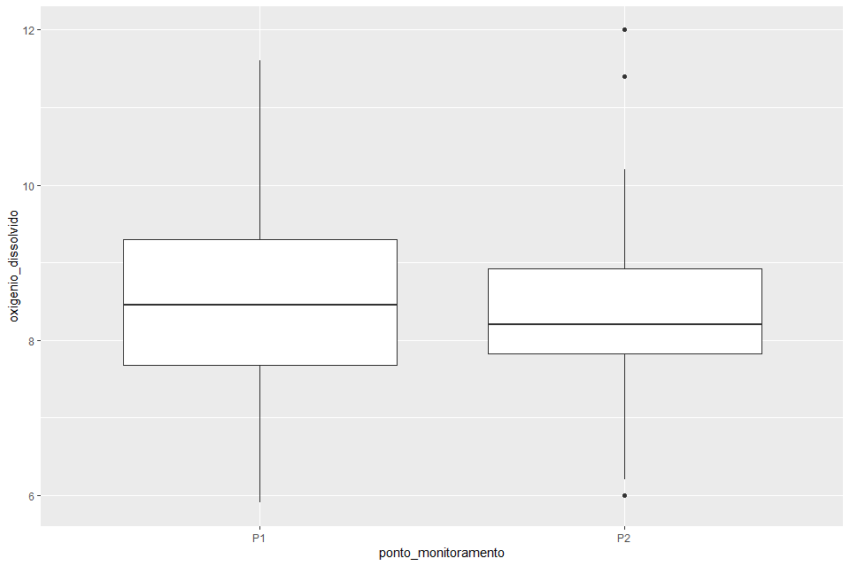<!-- -->


# Data viz
## OD

```r
(od <- dados_sinos %>% 
   boxplot_od(
     titulo = "Oxigênio Dissolvido no período 2007-2013",
   )
)
```

```
## Warning: Using `size` aesthetic for lines was deprecated in ggplot2 3.4.0.
## ℹ Please use `linewidth` instead.
```

```
## Warning: The `size` argument of `element_rect()` is deprecated as of ggplot2 3.4.0.
## ℹ Please use the `linewidth` argument instead.
```

```
## Warning: Removed 2855 rows containing non-finite values (`stat_boxplot()`).
```

```
## `geom_smooth()` using formula = 'y ~ x'
```

```
## Warning: Removed 2855 rows containing missing values.
```

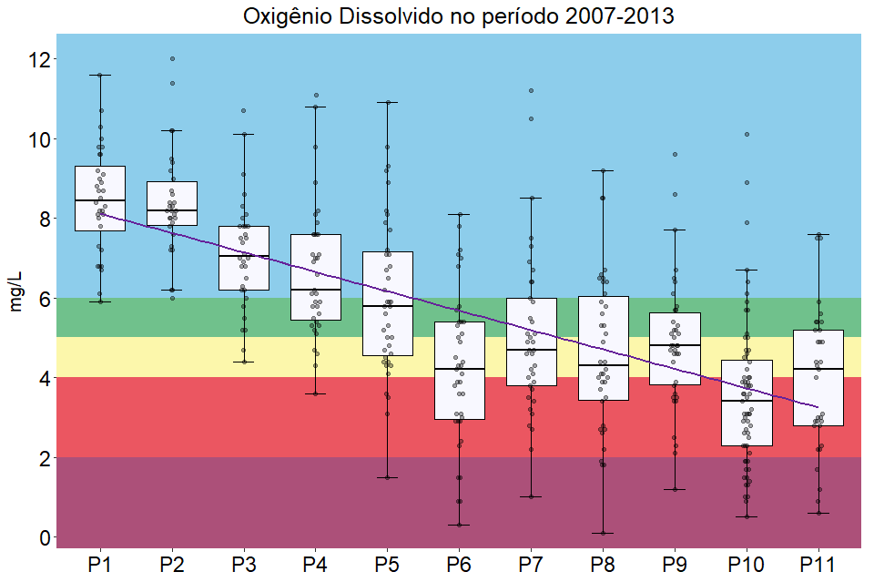<!-- -->


```r
(od_pb <- boxplot_od_pb())
```

```
## Warning: Removed 2855 rows containing non-finite values (`stat_boxplot()`).
```

```
## `geom_smooth()` using formula = 'y ~ x'
```

```
## Warning: Removed 2855 rows containing missing values.
```

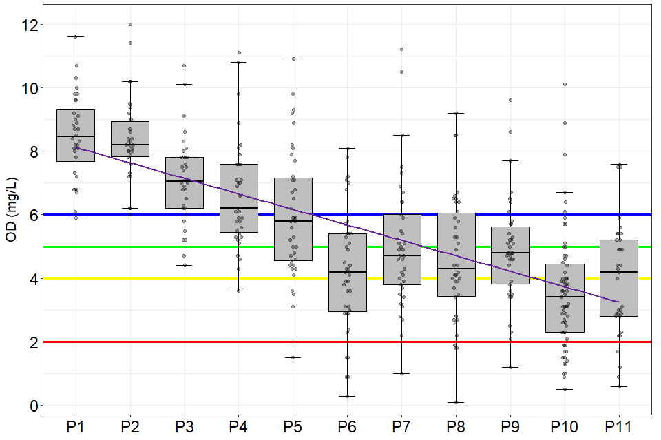<!-- -->


## DBO

```r
(dbo <- dados_sinos %>% 
   boxplot_dbo(
     titulo = "DBO"
   )
)
```

```
## Warning: Removed 2796 rows containing non-finite values (`stat_boxplot()`).
```

```
## `geom_smooth()` using formula = 'y ~ x'
```

```
## Warning: Removed 2796 rows containing missing values.
```

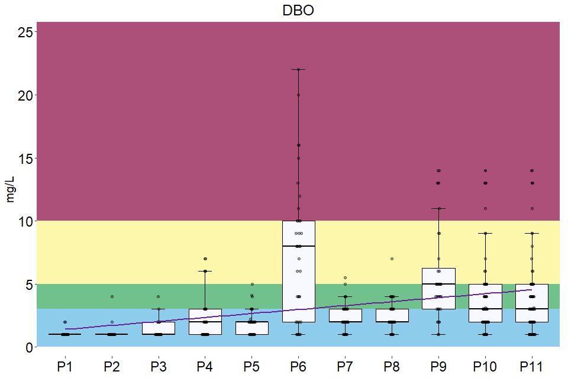<!-- -->


```r
(dbo_pb <- dados_sinos %>% 
   boxplot_dbo_pb()
)
```

```
## Warning: Removed 2796 rows containing non-finite values (`stat_boxplot()`).
## Removed 2796 rows containing non-finite values (`stat_boxplot()`).
```

```
## `geom_smooth()` using formula = 'y ~ x'
```

```
## Warning: Removed 2796 rows containing missing values.
```

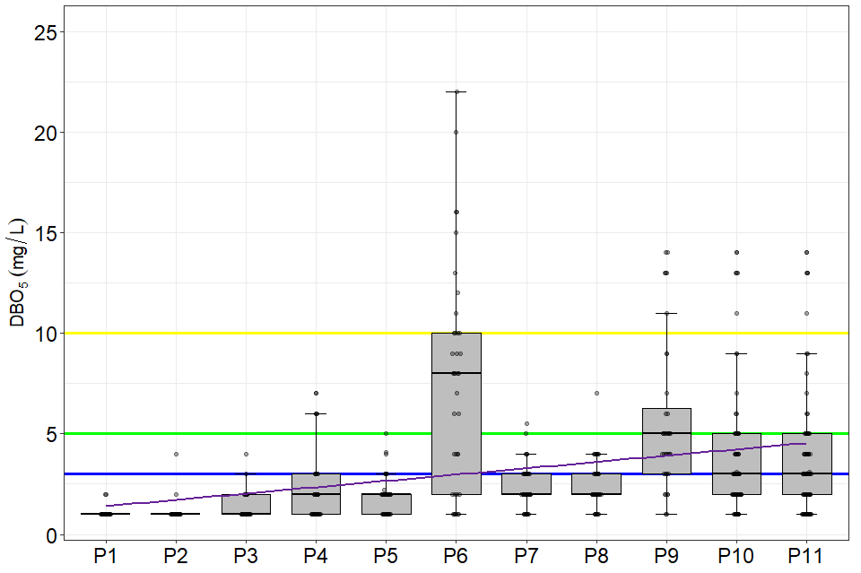<!-- -->


```r
(dbo <- ggplot2::ggplot(
    data = dados_sinos,
    aes(
      x = ponto_monitoramento,
      y = dbo
    )
  )+
    annotate("rect",
             xmin=-Inf, xmax=Inf,
             ymin=10, ymax=Inf,
             alpha=1,
             fill="#ac5079")+ #>pior classe
    annotate("rect",
             xmin=-Inf, xmax=Inf,
             ymin=5, ymax=10,
             alpha=1,
             fill="#fcf7ab")+ #classe 3
    annotate("rect",
             xmin=-Inf, xmax=Inf,
             ymin=3, ymax=5,
             alpha=1,
             fill="#70c18c")+ #classe 2
    annotate("rect",
             xmin=-Inf, xmax=Inf,
             ymin=0, ymax=3,
             alpha=1,
             fill="#8dcdeb")+ #classe 1
    # stat_summary(
    #   fun.data = f,
    #   geom = 'errorbar',
    #   width = 0.3,
    #   position = position_dodge(width = 0.65),
    # )+
  stat_boxplot(
      fun.data = f,
      geom = 'errorbar',
      na.rm = TRUE,
      coef = 1.5,
      width = 0.3,
      position = position_dodge(width = 0.65),
    )+
stat_boxplot(
  fun.data = f,
  geom = "boxplot",
  na.rm = TRUE,
  width = 0.7,
  fill = '#F8F8FF',
  color = "black",
  outlier.shape = NA, #se deixar NA fica só o jitter, se não, deixa 1
)+

# geom_boxplot(coef = 1.5)+
    labs(
      title = "Demanda Bioquímica de Oxigênio 2007-2013",
      x = "Estação",
      y = expression(DBO[5]~(mg/L)),
    )+
    ggbeeswarm::geom_quasirandom(
      size = 1.2,
      alpha = .25,
      width = .07,
    )+
    scale_x_discrete(
      limits = c(
        "P1", "P2", "P3", "P4", "P5", "P6",
        "P7", "P8", "P9", "P10", "P11"
      )

      # labels = c(
      #   "PM1", "PM2", "PM3", "PM4", "PM5", "PM6",
      #   "PM7", "PM8", "PM9", "PM10", "PM11"
      # )
    )+
    scale_y_continuous(
      expand = expansion(mult = c(0.03,0.03)),
      n.breaks = 8,
      limits = c(0,25),
      # trans = "log10"
    )+
    geom_smooth(method = "lm",
                se=FALSE, #se deixar TRUE gera o intervalo de confiança de 95%
                aes(group=1),
                alpha=.5,
                na.rm = TRUE,
                size = 1)+
    theme_grafs()
)
```

```
## Warning in stat_boxplot(fun.data = f, geom = "errorbar", na.rm = TRUE, coef =
## 1.5, : Ignoring unknown parameters: `fun.data`
```

```
## Warning in stat_boxplot(fun.data = f, geom = "boxplot", na.rm = TRUE, width =
## 0.7, : Ignoring unknown parameters: `fun.data`
```

```
## `geom_smooth()` using formula = 'y ~ x'
```

```
## Warning: Removed 2796 rows containing missing values.
```

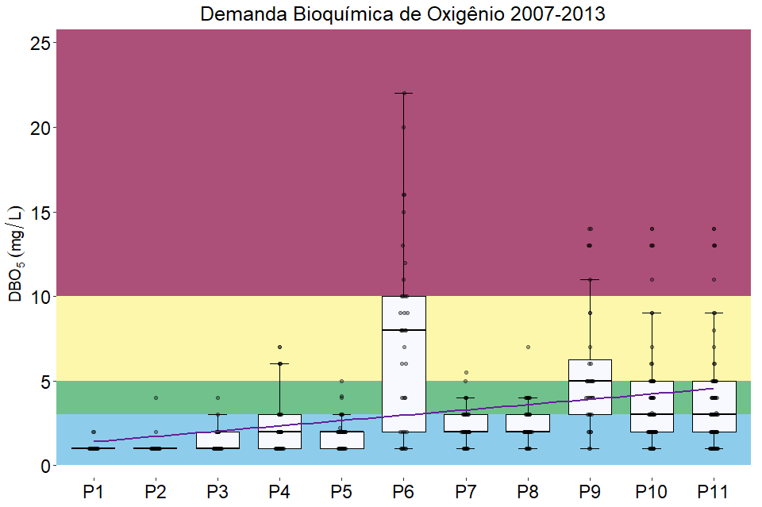<!-- -->


## Temperatura

```r
(temp_pb <- dados_sinos %>% 
   boxplot_temp_pb()
)
```

```
## Warning: Removed 2785 rows containing non-finite values (`stat_boxplot()`).
## Removed 2785 rows containing non-finite values (`stat_boxplot()`).
```

```
## `geom_smooth()` using formula = 'y ~ x'
```

```
## Warning: Removed 2785 rows containing missing values.
```

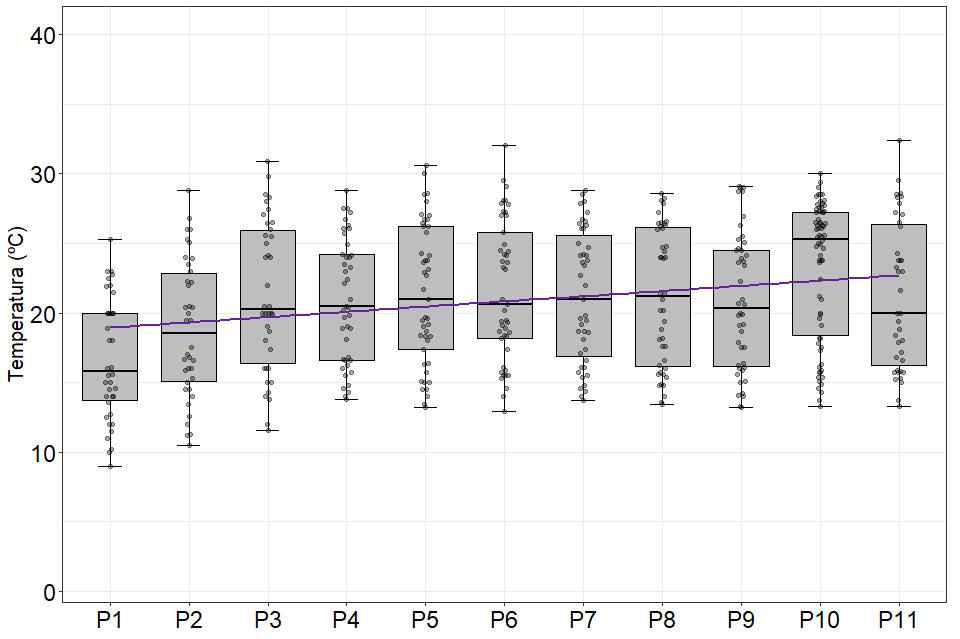<!-- -->


## pH

```r
(pH <- dados_sinos %>% 
   boxplot_pH()
)
```

```
## Warning: Removed 2838 rows containing non-finite values (`stat_boxplot()`).
## Removed 2838 rows containing non-finite values (`stat_boxplot()`).
```

```
## `geom_smooth()` using formula = 'y ~ x'
```

```
## Warning: Removed 2838 rows containing missing values.
```

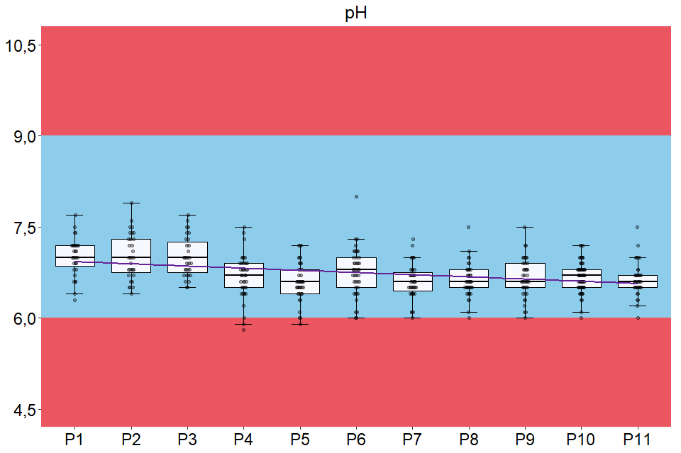<!-- -->


```r
(pH_pb <- dados_sinos %>% 
   boxplot_pH_pb()
)
```

```
## Warning: Removed 2838 rows containing non-finite values (`stat_boxplot()`).
## Removed 2838 rows containing non-finite values (`stat_boxplot()`).
```

```
## `geom_smooth()` using formula = 'y ~ x'
```

```
## Warning: Removed 2838 rows containing missing values.
```

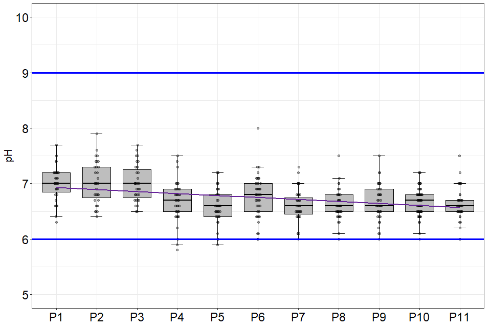<!-- -->


## Turbidez

```r
(turb_pb <- dados_sinos %>% 
   boxplot_turb_pb()
)
```

```
## Warning: Removed 2967 rows containing non-finite values (`stat_boxplot()`).
## Removed 2967 rows containing non-finite values (`stat_boxplot()`).
```

```
## `geom_smooth()` using formula = 'y ~ x'
```

```
## Warning: Removed 2967 rows containing missing values.
```

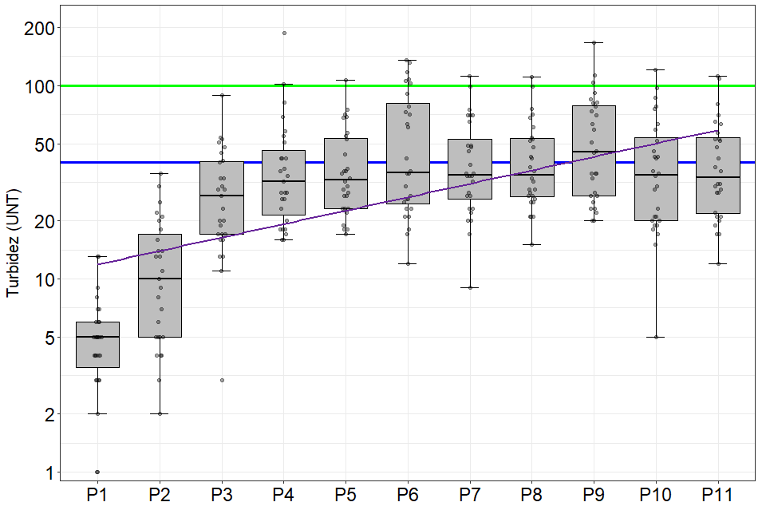<!-- -->

## ecoli

```r
(ecoli <- dados_sinos %>% 
   boxplot_ecoli()
)
```

```
## Warning: Transformation introduced infinite values in continuous y-axis
```

```
## Warning: Removed 2891 rows containing non-finite values (`stat_boxplot()`).
```

```
## `geom_smooth()` using formula = 'y ~ x'
```

```
## Warning: Removed 2891 rows containing missing values.
```

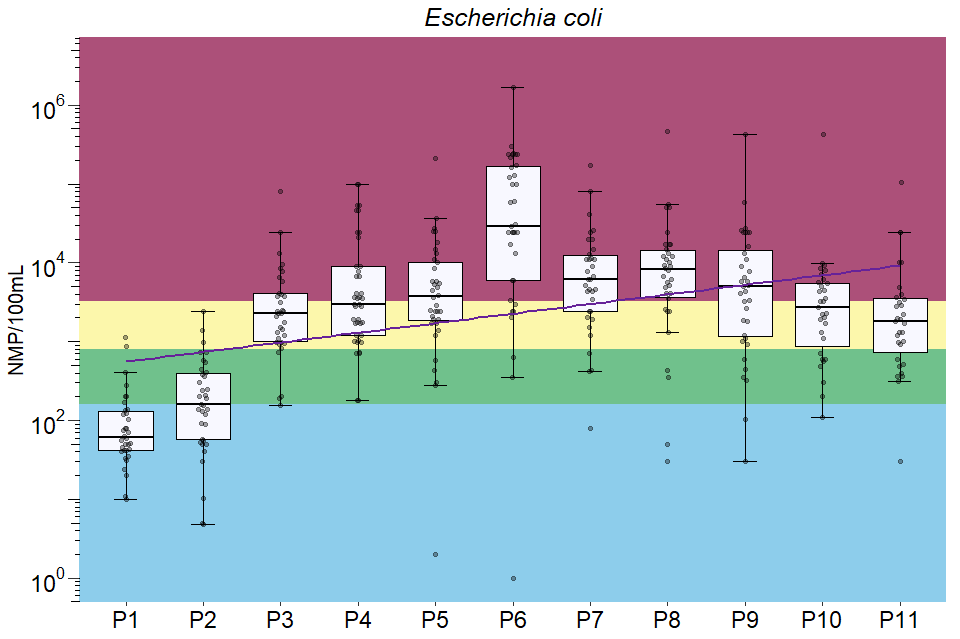<!-- -->


```r
(ecoli_pb <- dados_sinos %>% 
   boxplot_ecoli_pb()
)
```

```
## Warning: Removed 2891 rows containing non-finite values (`stat_boxplot()`).
```

```
## `geom_smooth()` using formula = 'y ~ x'
```

```
## Warning: Removed 2891 rows containing missing values.
```

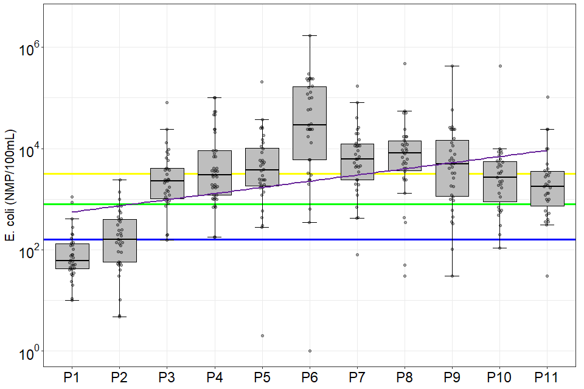<!-- -->

## namon

```r
(namon_pb <- dados_sinos %>% 
   boxplot_namon_pb()
)
```

```
## Warning: Removed 2902 rows containing non-finite values (`stat_boxplot()`).
## Removed 2902 rows containing non-finite values (`stat_boxplot()`).
```

```
## `geom_smooth()` using formula = 'y ~ x'
```

```
## Warning: Removed 2902 rows containing missing values.
```

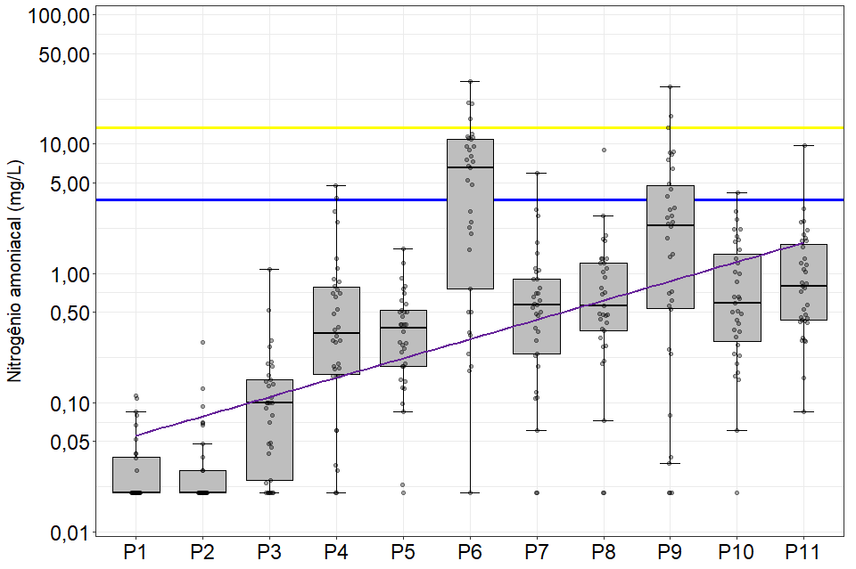<!-- -->

## sdt

```r
(st_pb <- dados_sinos %>% 
   boxplot_solidos_totais_pb()
)
```

```
## Warning: Removed 2863 rows containing non-finite values (`stat_boxplot()`).
## Removed 2863 rows containing non-finite values (`stat_boxplot()`).
```

```
## `geom_smooth()` using formula = 'y ~ x'
```

```
## Warning: Removed 2863 rows containing missing values.
```

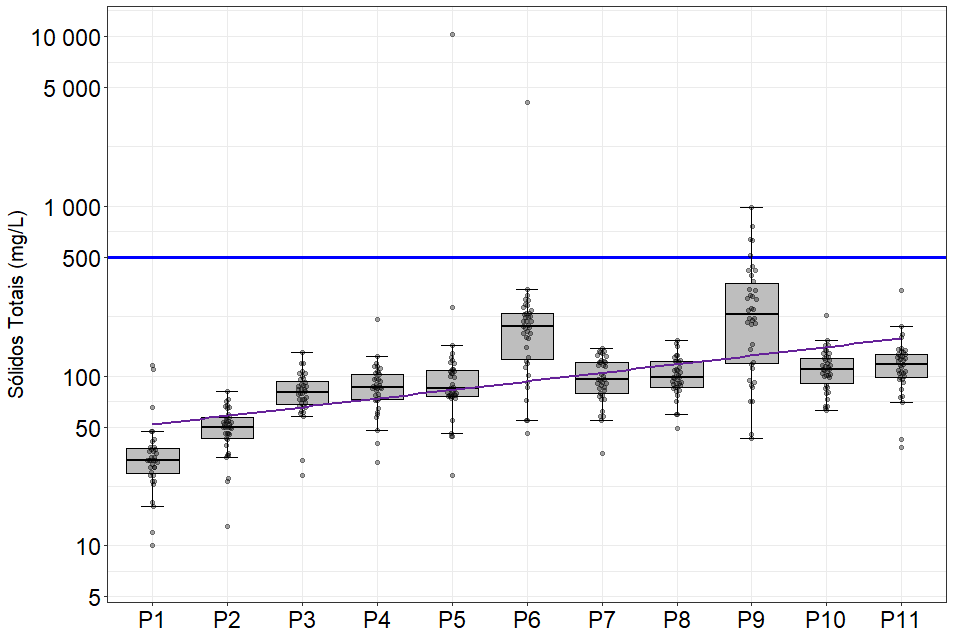<!-- -->

# qboxplot

```r
sinosSDT <- read.csv("est desc - SDT_R.csv",header=T)
sinosOD <- read.csv("est desc - OD_R.csv",header=T)
# png("sinosOD.png",width=1280, height= 1024, units = "px", res = 72)
```


```r
qboxplot(
  sinosOD,
  main="Oxigênio Dissolvido",
  probs=c(0.25,0.5,0.75),
  ylab="OD (mg/L)",
  xlab="Pontos",
  las=1,
  ylim=c(0,12),
  col=c(8),
  outpch="o"
)
stripchart(
  sinosOD,              # Data
  method = "jitter", # Random noise
  pch = 19,          # Pch symbols
  col = 1,           # Color of the symbol
  alpha = 0.2,
  add = TRUE,
  offset = 1.5,
  jitter = 1
)        # Add it over
```

```
## Warning in plot.xy(xy.coords(x, y), type = type, ...): "alpha" não é um
## parâmetro gráfico

## Warning in plot.xy(xy.coords(x, y), type = type, ...): "alpha" não é um
## parâmetro gráfico

## Warning in plot.xy(xy.coords(x, y), type = type, ...): "alpha" não é um
## parâmetro gráfico

## Warning in plot.xy(xy.coords(x, y), type = type, ...): "alpha" não é um
## parâmetro gráfico

## Warning in plot.xy(xy.coords(x, y), type = type, ...): "alpha" não é um
## parâmetro gráfico

## Warning in plot.xy(xy.coords(x, y), type = type, ...): "alpha" não é um
## parâmetro gráfico

## Warning in plot.xy(xy.coords(x, y), type = type, ...): "alpha" não é um
## parâmetro gráfico

## Warning in plot.xy(xy.coords(x, y), type = type, ...): "alpha" não é um
## parâmetro gráfico

## Warning in plot.xy(xy.coords(x, y), type = type, ...): "alpha" não é um
## parâmetro gráfico

## Warning in plot.xy(xy.coords(x, y), type = type, ...): "alpha" não é um
## parâmetro gráfico

## Warning in plot.xy(xy.coords(x, y), type = type, ...): "alpha" não é um
## parâmetro gráfico
```

```r
abline(h=6,col=4,lwd=2)
abline(h=5,col=3,lwd=2)
abline(h=4,col=7,lwd=2)
abline(h=2,col=2,lwd=2)
```

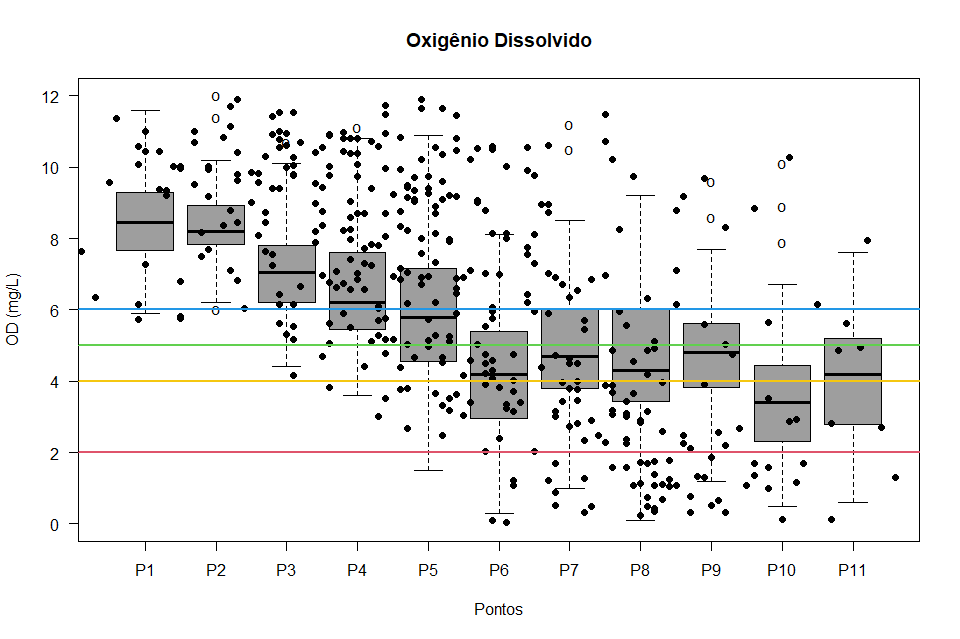<!-- -->

# Salvando gráficos

```r
ggsave("od.png",
       width = 1280,
       height = 1024,
       units = c("px"),
       plot = od_pb,
       path = "./graficos",
       dpi = 72,
       type = "cairo")
```

```
## Warning: Using ragg device as default. Ignoring `type` and `antialias` arguments
```

```
## Warning: Removed 2855 rows containing non-finite values (`stat_boxplot()`).
```

```
## `geom_smooth()` using formula = 'y ~ x'
```

```
## Warning: Removed 2855 rows containing missing values.
```

```r
ggsave("dbo.png",
       width = 1280,
       height = 1024,
       units = c("px"),
       plot = dbo_pb,
       path = "./graficos",
       dpi = 72,
       type = "cairo")
```

```
## Warning: Using ragg device as default. Ignoring `type` and `antialias` arguments
```

```
## Warning: Removed 2796 rows containing non-finite values (`stat_boxplot()`).
## Removed 2796 rows containing non-finite values (`stat_boxplot()`).
```

```
## `geom_smooth()` using formula = 'y ~ x'
```

```
## Warning: Removed 2796 rows containing missing values.
```

```r
ggsave("temp.png",
       width = 1280,
       height = 1024,
       units = c("px"),
       plot = temp_pb,
       path = "./graficos",
       dpi = 72,
       type = "cairo")
```

```
## Warning: Using ragg device as default. Ignoring `type` and `antialias` arguments
```

```
## Warning: Removed 2785 rows containing non-finite values (`stat_boxplot()`).
## Removed 2785 rows containing non-finite values (`stat_boxplot()`).
```

```
## `geom_smooth()` using formula = 'y ~ x'
```

```
## Warning: Removed 2785 rows containing missing values.
```

```r
ggsave("pH.png",
       width = 1280,
       height = 1024,
       units = c("px"),
       plot = pH_pb,
       path = "./graficos",
       dpi = 72,
       type = "cairo")
```

```
## Warning: Using ragg device as default. Ignoring `type` and `antialias` arguments
```

```
## Warning: Removed 2838 rows containing non-finite values (`stat_boxplot()`).
## Removed 2838 rows containing non-finite values (`stat_boxplot()`).
```

```
## `geom_smooth()` using formula = 'y ~ x'
```

```
## Warning: Removed 2838 rows containing missing values.
```

```r
ggsave("turb.png",
       width = 1280,
       height = 1024,
       units = c("px"),
       plot = turb_pb,
       path = "./graficos",
       dpi = 72,
       type = "cairo")
```

```
## Warning: Using ragg device as default. Ignoring `type` and `antialias` arguments
```

```
## Warning: Removed 2967 rows containing non-finite values (`stat_boxplot()`).
## Removed 2967 rows containing non-finite values (`stat_boxplot()`).
```

```
## `geom_smooth()` using formula = 'y ~ x'
```

```
## Warning: Removed 2967 rows containing missing values.
```

```r
ggsave("ecoli.png",
       width = 1280,
       height = 1024,
       units = c("px"),
       plot = ecoli_pb,
       path = "./graficos",
       dpi = 72,
       type = "cairo")
```

```
## Warning: Using ragg device as default. Ignoring `type` and `antialias` arguments
```

```
## Warning: Removed 2891 rows containing non-finite values (`stat_boxplot()`).
```

```
## `geom_smooth()` using formula = 'y ~ x'
```

```
## Warning: Removed 2891 rows containing missing values.
```

```r
ggsave("namon.png",
       width = 1280,
       height = 1024,
       units = c("px"),
       plot = namon_pb,
       path = "./graficos",
       dpi = 72,
       type = "cairo")
```

```
## Warning: Using ragg device as default. Ignoring `type` and `antialias` arguments
```

```
## Warning: Removed 2902 rows containing non-finite values (`stat_boxplot()`).
## Removed 2902 rows containing non-finite values (`stat_boxplot()`).
```

```
## `geom_smooth()` using formula = 'y ~ x'
```

```
## Warning: Removed 2902 rows containing missing values.
```

```r
ggsave("st.png",
       width = 1280,
       height = 1024,
       units = c("px"),
       plot = st_pb,
       path = "./graficos",
       dpi = 72,
       type = "cairo")
```

```
## Warning: Using ragg device as default. Ignoring `type` and `antialias` arguments
```

```
## Warning: Removed 2863 rows containing non-finite values (`stat_boxplot()`).
## Removed 2863 rows containing non-finite values (`stat_boxplot()`).
```

```
## `geom_smooth()` using formula = 'y ~ x'
```

```
## Warning: Removed 2863 rows containing missing values.
```

<!-- ```{r qboxplot_dbo} -->
<!-- qboxplot(sinosDBO,main="Demanda Bioquímica de Oxigênio",probs=c(0.25,0.5,0.75),ylab="DBO (mg/L)",xlab="Pontos",las=1,ylim=c(0,25),col=c(8), -->
<!-- outpch="o") -->
<!-- abline(h=10,col=7,lwd=2) -->
<!-- abline(h=3,col=4,lwd=2) -->
<!-- abline(h=5,col=3,lwd=2) -->
<!-- ``` -->


<!-- ```{r} -->
<!-- dev.off() -->
<!-- png("sinosOD.png",width=1280, height= 1024, units = "px", res = 72) -->
<!-- qboxplot(sinosOD,main="Oxigênio Dissolvido",probs=c(0.25,0.5,0.75),ylab="OD (mg/L)",xlab="Pontos",las=1,ylim=c(0,12),col=c(8),outpch="o") -->
<!-- abline(h=6,col=4,lwd=2) -->
<!-- abline(h=5,col=3,lwd=2) -->
<!-- abline(h=4,col=7,lwd=2) -->
<!-- abline(h=2,col=2,lwd=2) -->
<!-- dev.off() -->
<!-- dev.off() -->
<!-- png("sinosOD.png",width=1280, height= 1024, units = "px", res = 72) -->
<!-- qboxplot(sinosOD,main="Oxigênio Dissolvido",probs=c(0.25,0.5,0.75),ylab="OD (mg/L)",xlab="Pontos",las=1,ylim=c(0,12),col=c(8),outpch="o") -->
<!-- abline(h=6,col=4,lwd=2) -->
<!-- abline(h=5,col=3,lwd=2) -->
<!-- abline(h=4,col=7,lwd=2) -->
<!-- abline(h=2,col=2,lwd=2) -->
<!-- dev.off() -->
<!-- ?png -->
<!-- install.packages(grDevices) -->
<!-- install.packages("grDevices") -->
<!-- install.packages("grDevices") -->
<!-- install.packages("grDevices") -->
<!-- install.packages("grDevices") -->
<!-- install.packages("grDevices") -->
<!-- png("sinosOD.png",width=1280, height= 1024, units = "px", res = 72) -->
<!-- qboxplot(sinosOD,main="Oxigênio Dissolvido",probs=c(0.25,0.5,0.75),ylab="OD (mg/L)",xlab="Pontos",las=1,ylim=c(0,12),col=c(8),outpch="o") -->
<!-- abline(h=6,col=4,lwd=2) -->
<!-- abline(h=5,col=3,lwd=2) -->
<!-- abline(h=4,col=7,lwd=2) -->
<!-- abline(h=2,col=2,lwd=2) -->
<!-- library(qboxplot) -->
<!-- png("sinosOD.png",width=1280, height= 1024, units = "px", res = 72) -->
<!-- qboxplot(sinosOD,main="Oxigênio Dissolvido",probs=c(0.25,0.5,0.75),ylab="OD (mg/L)",xlab="Pontos",las=1,ylim=c(0,12),col=c(8),outpch="o") -->
<!-- abline(h=6,col=4,lwd=2) -->
<!-- abline(h=5,col=3,lwd=2) -->
<!-- abline(h=4,col=7,lwd=2) -->
<!-- abline(h=2,col=2,lwd=2) -->
<!-- qboxplot(sinosOD,main="Oxigênio Dissolvido",probs=c(0.25,0.5,0.75),ylab="OD (mg/L)",xlab="Pontos",las=1,ylim=c(0,12),col=c(8),outpch="o") -->
<!-- abline(h=6,col=4,lwd=2) -->
<!-- abline(h=5,col=3,lwd=2) -->
<!-- abline(h=4,col=7,lwd=2) -->
<!-- abline(h=2,col=2,lwd=2) -->
<!-- sinosOD<-read.csv(file.choose(),header=T) -->
<!-- sinosDBO<-read.csv(file.choose(),header=T) -->
<!-- sinosTemp<-read.csv(file.choose(),header=T) -->
<!-- sinospH<-read.csv(file.choose(),header=T) -->
<!-- sinosTurb<-read.csv(file.choose(),header=T) -->
<!-- sinosEcoli<-read.csv(file.choose(),header=T) -->
<!-- sinosNamon<-read.csv(file.choose(),header=T) -->
<!-- sinosSDT<-read.csv(file.choose(),header=T) -->
<!-- qboxplot(sinosOD,main="Oxigênio Dissolvido",probs=c(0.25,0.5,0.75),ylab="OD (mg/L)",xlab="Pontos",las=1,ylim=c(0,12),col=c(8),outpch="o") -->
<!-- abline(h=6,col=4,lwd=2) -->
<!-- abline(h=5,col=3,lwd=2) -->
<!-- abline(h=4,col=7,lwd=2) -->
<!-- abline(h=2,col=2,lwd=2) -->
<!-- save.image("C:/Users/Léo/Desktop/artigo sumire/workspace_art_sumire.RData") -->
<!-- png("sinosOD.png",width=1280, height= 1024, units = "px", res = 72) -->
<!-- qboxplot(sinosOD,main="Oxigênio Dissolvido",probs=c(0.25,0.5,0.75),ylab="OD (mg/L)",xlab="Pontos",las=1,ylim=c(0,12),col=c(8),outpch="o") -->
<!-- abline(h=6,col=4,lwd=2) -->
<!-- abline(h=5,col=3,lwd=2) -->
<!-- abline(h=4,col=7,lwd=2) -->
<!-- abline(h=2,col=2,lwd=2) -->
<!-- dev.off() -->
<!-- png("C:\\Users\\Léo\\Desktop\\artigo sumire\\sinosOD.png",width=1280, height= 1024, units = "px", res = 72) -->
<!-- qboxplot(sinosOD,main="Oxigênio Dissolvido",probs=c(0.25,0.5,0.75),ylab="OD (mg/L)",xlab="Pontos",las=1,ylim=c(0,12),col=c(8),outpch="o") -->
<!-- abline(h=6,col=4,lwd=2) -->
<!-- abline(h=5,col=3,lwd=2) -->
<!-- abline(h=4,col=7,lwd=2) -->
<!-- abline(h=2,col=2,lwd=2) -->
<!-- dev.off() -->
<!-- png("C:\\Users\\Léo\\Desktop\\artigo sumire\\sinosDBO.png",width=1280, height= 1024, units = "px", res = 72) -->
<!-- qboxplot(sinosDBO,main="Demanda Bioquímica de Oxigênio",probs=c(0.25,0.5,0.75),ylab="mg/L",xlab"Pontos",las=1,ylim=c(0,25),col=c(8),outpch="o") -->
<!-- abline(h=10,col=7,lwd=2) -->
<!-- abline(h=3,col=4,lwd=2) -->
<!-- abline(h=5,col=3,lwd=2) -->
<!-- dev.off() -->
<!-- png("C:\\Users\\Léo\\Desktop\\artigo sumire\\sinosDBO.png",width=1280, height= 1024, units = "px", res = 72) -->
<!-- qboxplot(sinosDBO,main="Demanda Bioquímica de Oxigênio",probs=c(0.25,0.5,0.75),ylab="mg/L",xlab="Pontos",las=1,ylim=c(0,25),col=c(8),outpch="o") -->
<!-- abline(h=10,col=7,lwd=2) -->
<!-- abline(h=3,col=4,lwd=2) -->
<!-- abline(h=5,col=3,lwd=2) -->
<!-- dev.off() -->
<!-- summary(sinosDBO) -->
<!-- qboxplot(sinosDBO,main="Demanda Bioquímica de Oxigênio",probs=c(0.25,0.5,0.75),ylab="mg/L",xlab="Pontos",las=1,ylim=c(0,25),col=c(8),outpch="o") -->
<!-- abline(h=10,col=7,lwd=2) -->
<!-- abline(h=3,col=4,lwd=2) -->
<!-- abline(h=5,col=3,lwd=2) -->
<!-- png("C:\\Users\\Léo\\Desktop\\artigo sumire\\sinosDBO.png",width=1280, height= 1024, units = "px", res = 72) -->
<!-- qboxplot(sinosDBO,main="Demanda Bioquímica de Oxigênio",probs=c(0.25,0.5,0.75),ylab="DBO (mg/L)",xlab="Pontos",las=1,ylim=c(0,25),col=c(8), -->
<!-- outpch="o") -->
<!-- abline(h=10,col=7,lwd=2) -->
<!-- abline(h=3,col=4,lwd=2) -->
<!-- abline(h=5,col=3,lwd=2) -->
<!-- dev.off() -->
<!-- png("C:\\Users\\Léo\\Desktop\\artigo sumire\\sinosDBO.png",width=1280, height= 1024, units = "px", res = 72) -->
<!-- abline(h=10,col=7,lwd=2) -->
<!-- abline(h=3,col=4,lwd=2) -->
<!-- abline(h=5,col=3,lwd=2) -->
<!-- qboxplot(sinosDBO,main="Demanda Bioquímica de Oxigênio",probs=c(0.25,0.5,0.75),ylab="DBO (mg/L)",xlab="Pontos",las=1,ylim=c(0,25),col=c(8), -->
<!-- outpch="o") -->
<!-- dev.off() -->
<!-- png("C:\\Users\\Léo\\Desktop\\artigo sumire\\sinosDBO.png",width=1280, height= 1024, units = "px", res = 72) -->
<!-- qboxplot( -->
<!-- abline(h=10,col=7,lwd=2) -->
<!-- abline(h=3,col=4,lwd=2) -->
<!-- abline(h=5,col=3,lwd=2) -->
<!-- sinosDBO,main="Demanda Bioquímica de Oxigênio",probs=c(0.25,0.5,0.75),ylab="DBO (mg/L)",xlab="Pontos",las=1,ylim=c(0,25),col=c(8), -->
<!-- outpch="o") -->
<!-- dev.off() -->
<!-- png("C:\\Users\\Léo\\Desktop\\artigo sumire\\sinosDBO.png",width=1280, height= 1024, units = "px", res = 72) -->


<!-- qboxplot(sinosDBO,main="Demanda Bioquímica de Oxigênio",probs=c(0.25,0.5,0.75),ylab="DBO (mg/L)",xlab="Pontos",las=1,ylim=c(0,25),col=c(8), -->
<!-- outpch="o") -->
<!-- abline(h=10,col=7,lwd=2) -->
<!-- abline(h=3,col=4,lwd=2) -->
<!-- abline(h=5,col=3,lwd=2) -->


<!-- dev.off() -->
<!-- png("C:\\Users\\Léo\\Desktop\\artigo sumire\\sinosDBO.png",width=1280, height= 1024, units = "px", res = 72) -->
<!-- qboxplot(sinosDBO,main="Demanda Bioquímica de Oxigênio",probs=c(0.25,0.5,0.75),ylab="DBO5 (mg/L)",xlab="Pontos",las=1,ylim=c(0,25),col=c(8), -->
<!-- outpch="o") -->
<!-- abline(h=10,col=7,lwd=2) -->
<!-- abline(h=3,col=4,lwd=2) -->
<!-- abline(h=5,col=3,lwd=2) -->
<!-- dev.off() -->
<!-- qboxplot(sinosTurb,log="y",probs=c(0.25,0.5,0.75),ylab="Turbidez (UNT)",xlab="Pontos",ylim=c(5,500),las=1,col=c(8), -->
<!-- outpch="o") -->
<!-- abline(h=40,col=4,lwd=2) -->
<!-- abline(h=100,col=7,lwd=2) -->
<!-- summary(sinosTurb) -->
<!-- qboxplot(sinosTurb,log="y",probs=c(0.25,0.5,0.75),ylab="Turbidez (UNT)",xlab="Pontos",ylim=c(0.1,500),las=1,col=c(8), -->
<!-- outpch="o") -->
<!-- abline(h=40,col=4,lwd=2) -->
<!-- abline(h=100,col=7,lwd=2) -->
<!-- qboxplot(sinosTurb,log="y",probs=c(0.25,0.5,0.75),ylab="Turbidez (UNT)",xlab="Pontos",ylim=c(1,500),las=1,col=c(8), -->
<!-- outpch="o") -->
<!-- abline(h=40,col=4,lwd=2) -->
<!-- abline(h=100,col=7,lwd=2) -->
<!-- qboxplot(sinosTurb,probs=c(0.25,0.5,0.75),ylab="Turbidez (UNT)",xlab="Pontos",ylim=c(1,500),las=1,col=c(8), -->
<!-- outpch="o") -->
<!-- abline(h=40,col=4,lwd=2) -->
<!-- abline(h=100,col=7,lwd=2) -->
<!-- qboxplot(sinosTurb,probs=c(0.25,0.5,0.75),ylab="Turbidez (UNT)",xlab="Pontos",ylim=c(1,200),las=1,col=c(8), -->
<!-- outpch="o") -->
<!-- abline(h=40,col=4,lwd=2) -->
<!-- abline(h=100,col=7,lwd=2) -->
<!-- qboxplot(sinosTurb,log="y",probs=c(0.25,0.5,0.75),ylab="Turbidez (UNT)",xlab="Pontos",ylim=c(1,200),las=1,col=c(8), -->
<!-- outpch="o") -->
<!-- abline(h=40,col=4,lwd=2) -->
<!-- abline(h=100,col=7,lwd=2) -->
<!-- png("C:\\Users\\Léo\\Desktop\\artigo sumire\\sinosTurb.png",width=1280, height= 1024, units = "px", res = 72) -->
<!-- qboxplot(sinosTurb,log="y",probs=c(0.25,0.5,0.75),ylab="Turbidez (UNT)",xlab="Pontos",ylim=c(1,200),las=1,col=c(8), -->
<!-- outpch="o") -->
<!-- abline(h=40,col=4,lwd=2) -->
<!-- abline(h=100,col=7,lwd=2) -->
<!-- dev.off() -->
<!-- qboxplot(sinosTemp,probs=c(0.25,0.5,0.75),ylab="Temperatura (ºC)",xlab="Pontos",ylim=c(0,30),las=1,col=c(8), -->
<!-- outpch="o") -->
<!-- summary(sinosTemp) -->
<!-- qboxplot(sinosTemp,probs=c(0.25,0.5,0.75),ylab="Temperatura (ºC)",xlab="Pontos",ylim=c(0,35),las=1,col=c(8), -->
<!-- outpch="o") -->
<!-- png("C:\\Users\\Léo\\Desktop\\artigo sumire\\sinosTemp.png",width=1280, height= 1024, units = "px", res = 72) -->
<!-- qboxplot(sinosTemp,probs=c(0.25,0.5,0.75),ylab="Temperatura (ºC)",xlab="Pontos",ylim=c(0,35),las=1,col=c(8), -->
<!-- outpch="o") -->
<!-- dev.off() -->
<!-- qboxplot(sinospH,probs=c(0.25,0.5,0.75),ylab="pH",xlab="Pontos",las=1,ylim=c(0,14),col=c(8),outpch="o") -->
<!-- abline(h=6,col=4,lwd=2) -->
<!-- abline(h=9,col=2,lwd=2) -->
<!-- qboxplot(sinospH,probs=c(0.25,0.5,0.75),log="y",ylab="pH",xlab="Pontos",las=1,ylim=c(0,14),col=c(8),outpch="o") -->
<!-- abline(h=6,col=4,lwd=2) -->
<!-- abline(h=9,col=2,lwd=2) -->
<!-- qboxplot(sinospH,probs=c(0.25,0.5,0.75),log="y",ylab="pH",xlab="Pontos",las=1,ylim=c(1,14),col=c(8),outpch="o") -->
<!-- abline(h=6,col=4,lwd=2) -->
<!-- abline(h=9,col=2,lwd=2) -->
<!-- qboxplot(sinospH,probs=c(0.25,0.5,0.75),log="y",ylab="pH",xlab="Pontos",las=1,ylim=c(0,14),col=c(8),outpch="o") -->
<!-- abline(h=6,col=4,lwd=2) -->
<!-- abline(h=9,col=2,lwd=2) -->
<!-- qboxplot(sinospH,probs=c(0.25,0.5,0.75),ylab="pH",xlab="Pontos",las=1,ylim=c(0,14),col=c(8),outpch="o") -->
<!-- abline(h=6,col=4,lwd=2) -->
<!-- abline(h=9,col=2,lwd=2) -->
<!-- summary(sinospH) -->
<!-- qboxplot(sinospH,probs=c(0.25,0.5,0.75),ylab="pH",xlab="Pontos",las=1,ylim=c(4,10),col=c(8),outpch="o") -->
<!-- abline(h=6,col=4,lwd=2) -->
<!-- abline(h=9,col=2,lwd=2) -->
<!-- qboxplot(sinospH,probs=c(0.25,0.5,0.75),ylab="pH",xlab="Pontos",las=1,ylim=c(5,10),col=c(8),outpch="o") -->
<!-- abline(h=6,col=4,lwd=2) -->
<!-- abline(h=9,col=2,lwd=2) -->
<!-- qboxplot(sinospH,probs=c(0.25,0.5,0.75),ylab="pH",xlab="Pontos",las=1,ylim=c(4,10),col=c(8),outpch="o") -->
<!-- abline(h=6,col=4,lwd=2) -->
<!-- abline(h=9,col=2,lwd=2) -->
<!-- qboxplot(sinospH,probs=c(0.25,0.5,0.75),ylab="pH",xlab="Pontos",las=1,ylim=c(5,10),col=c(8),outpch="o") -->
<!-- abline(h=6,col=4,lwd=2) -->
<!-- abline(h=9,col=2,lwd=2) -->
<!-- qboxplot(sinospH,probs=c(0.25,0.5,0.75),ylab="pH",xlab="Pontos",las=1,ylim=c(0,14),col=c(8),outpch="o") -->
<!-- abline(h=6,col=4,lwd=2) -->
<!-- abline(h=9,col=2,lwd=2) -->
<!-- png("C:\\Users\\Léo\\Desktop\\artigo sumire\\sinospH-1.png",width=1280, height= 1024, units = "px", res = 72) -->
<!-- qboxplot(sinospH,probs=c(0.25,0.5,0.75),ylab="pH",xlab="Pontos",las=1,ylim=c(0,14),col=c(8),outpch="o") -->
<!-- abline(h=6,col=4,lwd=2) -->
<!-- abline(h=9,col=2,lwd=2) -->
<!-- dev.off() -->
<!-- png("C:\\Users\\Léo\\Desktop\\artigo sumire\\sinospH-2.png",width=1280, height= 1024, units = "px", res = 72) -->
<!-- qboxplot(sinospH,probs=c(0.25,0.5,0.75),ylab="pH",xlab="Pontos",las=1,ylim=c(4,10),col=c(8),outpch="o") -->
<!-- abline(h=6,col=4,lwd=2) -->
<!-- abline(h=9,col=2,lwd=2) -->
<!-- dev.off() -->
<!-- png("C:\\Users\\Léo\\Desktop\\artigo sumire\\sinospH-3.png",width=1280, height= 1024, units = "px", res = 72) -->
<!-- qboxplot(sinospH,probs=c(0.25,0.5,0.75),ylab="pH",xlab="Pontos",las=1,ylim=c(5,10),col=c(8),outpch="o") -->
<!-- abline(h=6,col=4,lwd=2) -->
<!-- abline(h=9,col=2,lwd=2) -->
<!-- dev.off() -->
<!-- png("C:\\Users\\Léo\\Desktop\\artigo sumire\\sinosDBO.png",width=1280, height= 1024, units = "px", res = 72) -->
<!-- qboxplot(sinosDBO,probs=c(0.25,0.5,0.75),ylab="DBO5 (mg/L)",xlab="Pontos",las=1,ylim=c(0,25),col=c(8), -->
<!-- outpch="o") -->
<!-- abline(h=10,col=7,lwd=2) -->
<!-- abline(h=3,col=4,lwd=2) -->
<!-- abline(h=5,col=3,lwd=2) -->
<!-- dev.off() -->
<!-- png("C:\\Users\\Léo\\Desktop\\artigo sumire\\sinosDBO.png",width=640, height= 512, units = "px", res = 72) -->
<!-- qboxplot(sinosDBO,probs=c(0.25,0.5,0.75),ylab="DBO5 (mg/L)",xlab="Pontos",las=1,ylim=c(0,25),col=c(8), -->
<!-- outpch="o") -->
<!-- abline(h=10,col=7,lwd=2) -->
<!-- abline(h=3,col=4,lwd=2) -->
<!-- abline(h=5,col=3,lwd=2) -->
<!-- dev.off() -->
<!-- png("C:\\Users\\Léo\\Desktop\\artigo sumire\\sinosOD.png",width=640, height= 512, units = "px", res = 72) -->
<!-- qboxplot(sinosOD,probs=c(0.25,0.5,0.75),ylab="OD (mg/L)",xlab="Pontos",las=1,ylim=c(0,12),col=c(8),outpch="o") -->
<!-- abline(h=6,col=4,lwd=2) -->
<!-- abline(h=5,col=3,lwd=2) -->
<!-- abline(h=4,col=7,lwd=2) -->
<!-- abline(h=2,col=2,lwd=2) -->
<!-- dev.off() -->
<!-- png("C:\\Users\\Léo\\Desktop\\artigo sumire\\sinosDBO.png",width=640, height= 512, units = "px", res = 72) -->
<!-- qboxplot(sinosDBO,probs=c(0.25,0.5,0.75),ylab="DBO5 (mg/L)",xlab="Pontos",las=1,ylim=c(0,25),col=c(8), -->
<!-- outpch="o") -->
<!-- abline(h=10,col=7,lwd=2) -->
<!-- abline(h=3,col=4,lwd=2) -->
<!-- abline(h=5,col=3,lwd=2) -->
<!-- dev.off() -->
<!-- png("C:\\Users\\Léo\\Desktop\\artigo sumire\\sinosTurb.png",width=640, height= 512, units = "px", res = 72) -->
<!-- qboxplot(sinosTurb,log="y",probs=c(0.25,0.5,0.75),ylab="Turbidez (UNT)",xlab="Pontos",ylim=c(1,200),las=1,col=c(8), -->
<!-- outpch="o") -->
<!-- abline(h=40,col=4,lwd=2) -->
<!-- abline(h=100,col=7,lwd=2) -->
<!-- dev.off() -->
<!-- png("C:\\Users\\Léo\\Desktop\\artigo sumire\\sinosTemp.png",width=640, height= 512, units = "px", res = 72) -->
<!-- qboxplot(sinosTemp,probs=c(0.25,0.5,0.75),ylab="Temperatura (ºC)",xlab="Pontos",ylim=c(0,35),las=1,col=c(8), -->
<!-- outpch="o") -->
<!-- dev.off() -->
<!-- png("C:\\Users\\Léo\\Desktop\\artigo sumire\\sinospH-1.png",width=640, height= 512, units = "px", res = 72) -->
<!-- qboxplot(sinospH,probs=c(0.25,0.5,0.75),ylab="pH",xlab="Pontos",las=1,ylim=c(0,14),col=c(8),outpch="o") -->
<!-- abline(h=6,col=4,lwd=2) -->
<!-- abline(h=9,col=2,lwd=2) -->
<!-- dev.off() -->
<!-- png("C:\\Users\\Léo\\Desktop\\artigo sumire\\sinospH-2.png",width=640, height= 512, units = "px", res = 72) -->
<!-- qboxplot(sinospH,probs=c(0.25,0.5,0.75),ylab="pH",xlab="Pontos",las=1,ylim=c(4,10),col=c(8),outpch="o") -->
<!-- abline(h=6,col=4,lwd=2) -->
<!-- abline(h=9,col=2,lwd=2) -->
<!-- dev.off() -->
<!-- png("C:\\Users\\Léo\\Desktop\\artigo sumire\\sinospH-3.png",width=640, height= 512, units = "px", res = 72) -->
<!-- qboxplot(sinospH,probs=c(0.25,0.5,0.75),ylab="pH",xlab="Pontos",las=1,ylim=c(5,10),col=c(8),outpch="o") -->
<!-- abline(h=6,col=4,lwd=2) -->
<!-- abline(h=9,col=2,lwd=2) -->
<!-- dev.off() -->
<!-- qboxplot(sinosEcoli,probs=c(0.25,0.5,0.75),ylab="NMP/100mL",log="y",las=0,ylim=c(10,10000000),col=c(8), -->
<!-- outpch="o") -->
<!-- abline(h=160,col=4,lwd=2) -->
<!-- abline(h=800,col=3,lwd=2) -->
<!-- abline(h=3200,col=7,lwd=2) -->
<!-- summary(sinosEcoli) -->
<!-- qboxplot(sinosEcoli,probs=c(0.25,0.5,0.75),ylab="NMP/100mL",log="y",las=0,ylim=c(1,10000000),col=c(8), -->
<!-- outpch="o") -->
<!-- abline(h=160,col=4,lwd=2) -->
<!-- abline(h=800,col=3,lwd=2) -->
<!-- abline(h=3200,col=7,lwd=2) -->
<!-- qboxplot(sinosEcoli,probs=c(0.25,0.5,0.75),ylab="NMP/100mL",log="y",las=0,ylim=c(1,5000000),col=c(8), -->
<!-- outpch="o") -->
<!-- abline(h=160,col=4,lwd=2) -->
<!-- abline(h=800,col=3,lwd=2) -->
<!-- abline(h=3200,col=7,lwd=2) -->
<!-- qboxplot(sinosEcoli,probs=c(0.25,0.5,0.75),ylab="NMP/100mL",log="y",las=0,ylim=c(1,10000000),col=c(8), -->
<!-- outpch="o") -->
<!-- abline(h=160,col=4,lwd=2) -->
<!-- abline(h=800,col=3,lwd=2) -->
<!-- abline(h=3200,col=7,lwd=2) -->
<!-- qboxplot(sinosEcoli,probs=c(0.25,0.5,0.75),ylab="NMP/100mL",log="y",las=0,ylim=c(1,100000000),col=c(8), -->
<!-- outpch="o") -->
<!-- abline(h=160,col=4,lwd=2) -->
<!-- abline(h=800,col=3,lwd=2) -->
<!-- abline(h=3200,col=7,lwd=2) -->
<!-- qboxplot(sinosEcoli,probs=c(0.25,0.5,0.75),ylab="NMP/100mL",log="y",las=0,ylim=c(1,10000000),col=c(8), -->
<!-- outpch="o") -->
<!-- abline(h=160,col=4,lwd=2) -->
<!-- abline(h=800,col=3,lwd=2) -->
<!-- abline(h=3200,col=7,lwd=2) -->
<!-- qboxplot(sinosEcoli,probs=c(0.25,0.5,0.75),ylab="NMP/100mL",log="y",las=0,ylim=c(1,15000000),col=c(8), -->
<!-- outpch="o") -->
<!-- abline(h=160,col=4,lwd=2) -->
<!-- abline(h=800,col=3,lwd=2) -->
<!-- abline(h=3200,col=7,lwd=2) -->
<!-- qboxplot(sinosEcoli,probs=c(0.25,0.5,0.75),ylab="NMP/100mL",log="y",las=0,ylim=c(1,25000000),col=c(8), -->
<!-- outpch="o") -->
<!-- abline(h=160,col=4,lwd=2) -->
<!-- abline(h=800,col=3,lwd=2) -->
<!-- abline(h=3200,col=7,lwd=2) -->
<!-- qboxplot(sinosEcoli,probs=c(0.25,0.5,0.75),ylab="NMP/100mL",log="y",las=0,ylim=c(1,30000000),col=c(8), -->
<!-- outpch="o") -->
<!-- abline(h=160,col=4,lwd=2) -->
<!-- abline(h=800,col=3,lwd=2) -->
<!-- abline(h=3200,col=7,lwd=2) -->
<!-- qboxplot(sinosEcoli,probs=c(0.25,0.5,0.75),ylab="NMP/100mL",log="y",las=0,ylim=c(1,50000000),col=c(8), -->
<!-- outpch="o") -->
<!-- abline(h=160,col=4,lwd=2) -->
<!-- abline(h=800,col=3,lwd=2) -->
<!-- abline(h=3200,col=7,lwd=2) -->
<!-- qboxplot(sinosEcoli,probs=c(0.25,0.5,0.75),ylab="NMP/100mL",log="y",las=1,ylim=c(1,30000000),col=c(8), -->
<!-- outpch="o") -->
<!-- abline(h=160,col=4,lwd=2) -->
<!-- abline(h=800,col=3,lwd=2) -->
<!-- abline(h=3200,col=7,lwd=2) -->
<!-- qboxplot(sinosEcoli,probs=c(0.25,0.5,0.75),ylab="NMP/100mL",log="y",las=0,ylim=c(1,50000000),col=c(8), -->
<!-- outpch="o") -->
<!-- abline(h=160,col=4,lwd=2) -->
<!-- abline(h=800,col=3,lwd=2) -->
<!-- abline(h=3200,col=7,lwd=2) -->
<!-- sumario-ecoli<-summary(sinosEcoli) -->
<!-- summary(sinosEcoli) -->
<!-- library(Hmisc) -->
<!-- install.packages("Hmisc") -->
<!-- library(Hmisc) -->
<!-- describe(sinosEcoli) -->
<!-- sapply(sinosOD) -->
<!-- sapply(sinosOD,mean) -->
<!-- View(sinosOD) -->
<!-- summary(sinosOD) -->
<!-- summary(sinosEcoli) -->
<!-- sumario_ecoli<-summary(sinosEcoli) -->
<!-- ?write.table -->
<!-- write.table(sumario_ecoli,file="sumario_ecoli.csv",sep = ",",col.names = TRUE) -->
<!-- write.table(sumario_ecoli,file="sumario_ecoli.csv",append = TRUE ,sep = ",",col.names = TRUE) -->
<!-- qboxplot(sinosEcoli,probs=c(0.25,0.5,0.75),ylab="NMP/100mL",log="y",las=0,ylim=c(1,50000000),col=c(8), -->
<!-- outpch="o") -->
<!-- abline(h=160,col=4,lwd=2) -->
<!-- abline(h=800,col=3,lwd=2) -->
<!-- abline(h=3200,col=7,lwd=2) -->
<!-- png("C:\\Users\\Léo\\Desktop\\artigo sumire\\sinosEcoli.png",width=640, height= 512, units = "px", res = 72) -->
<!-- qboxplot(sinosEcoli,probs=c(0.25,0.5,0.75),ylab="NMP/100mL",log="y",las=0,ylim=c(1,50000000),col=c(8), -->
<!-- outpch="o") -->
<!-- abline(h=160,col=4,lwd=2) -->
<!-- abline(h=800,col=3,lwd=2) -->
<!-- abline(h=3200,col=7,lwd=2) -->
<!-- dev.off() -->
<!-- qboxplot(sinosNamon,probs=c(0.25,0.5,0.75),ylab="mg/L",log="y",las=1, ylim=c(0.005,50),col=c(8), outpch="o") -->
<!-- abline(h=13.3,col=7,lwd=2) -->
<!-- abline(h=3.7,col=4,lwd=2) -->
<!-- summary(sinosNamon) -->
<!-- qboxplot(sinosNamon,probs=c(0.25,0.5,0.75),ylab="mg/L",log="y",las=1, ylim=c(0.05,50),col=c(8), outpch="o") -->
<!-- abline(h=13.3,col=7,lwd=2) -->
<!-- abline(h=3.7,col=4,lwd=2) -->
<!-- qboxplot(sinosNamon,probs=c(0.25,0.5,0.75),ylab="mg/L",log="y",las=1, ylim=c(0.005,50),col=c(8), outpch="o") -->
<!-- abline(h=13.3,col=7,lwd=2) -->
<!-- abline(h=3.7,col=4,lwd=2) -->
<!-- qboxplot(sinosNamon,probs=c(0.25,0.5,0.75),ylab="mg/L",log="y",las=1, ylim=c(0.01,50),col=c(8), outpch="o") -->
<!-- abline(h=13.3,col=7,lwd=2) -->
<!-- abline(h=3.7,col=4,lwd=2) -->
<!-- png("C:\\Users\\Léo\\Desktop\\artigo sumire\\sinosNamon.png",width=640, height= 512, units = "px", res = 72) -->
<!-- qboxplot(sinosNamon,probs=c(0.25,0.5,0.75),ylab="mg/L",log="y",las=1, ylim=c(0.01,50),col=c(8), outpch="o") -->
<!-- abline(h=13.3,col=7,lwd=2) -->
<!-- abline(h=3.7,col=4,lwd=2) -->
<!-- dev.off() -->
<!-- png("C:\\Users\\Léo\\Desktop\\artigo sumire\\sinosNamon.png",width=640, height= 512, units = "px", res = 72) -->
<!-- qboxplot(sinosNamon,probs=c(0.25,0.5,0.75),ylab="Nitrogênio amoniacal (mg/L)",log="y",las=1, ylim=c(0.01,50),col=c(8), outpch="o") -->
<!-- abline(h=13.3,col=7,lwd=2) -->
<!-- abline(h=3.7,col=4,lwd=2) -->
<!-- dev.off() -->
<!-- qboxplot(sinosNamon,probs=c(0.25,0.5,0.75),ylab="Nitrogênio amoniacal (mg/L)",log="y",las=1, ylim=c(0.01,50),col=c(8), outpch="o") -->
<!-- abline(h=13.3,col=7,lwd=2) -->
<!-- abline(h=3.7,col=3,lwd=2) -->
<!-- png("C:\\Users\\Léo\\Desktop\\artigo sumire\\sinosNamon.png",width=640, height= 512, units = "px", res = 72) -->
<!-- qboxplot(sinosNamon,probs=c(0.25,0.5,0.75),ylab="Nitrogênio amoniacal (mg/L)",log="y",las=1, ylim=c(0.01,50),col=c(8), outpch="o") -->
<!-- abline(h=13.3,col=7,lwd=2) -->
<!-- abline(h=3.7,col=4,lwd=2) -->
<!-- dev.off() -->
<!-- qboxplot(sinosSDT,probs=c(0.25,0.5,0.75),ylab="Sólidos Totais (mg/L)",log="y",las=1, ylim=c(0.01,50),col=c(8), outpch="o") -->
<!-- abline(h=500,col=7,lwd=2) -->
<!-- summary(sinosSDT) -->
<!-- qboxplot(sinosSDT,probs=c(0.25,0.5,0.75),ylab="Sólidos Totais (mg/L)",log="y",las=1, ylim=c(1,15000),col=c(8), outpch="o") -->
<!-- abline(h=500,col=7,lwd=2) -->
<!-- qboxplot(sinosSDT,probs=c(0.25,0.5,0.75),ylab="Sólidos Totais (mg/L)",log="y",las=1, ylim=c(10,15000),col=c(8), outpch="o") -->
<!-- abline(h=500,col=7,lwd=2) -->
<!-- qboxplot(sinosSDT,probs=c(0.25,0.5,0.75),ylab="Sólidos Totais (mg/L)",log="y",las=1, ylim=c(10,10000),col=c(8), outpch="o") -->
<!-- abline(h=500,col=7,lwd=2) -->
<!-- qboxplot(sinosSDT,probs=c(0.25,0.5,0.75),ylab="Sólidos Totais (mg/L)",log="y",las=1, ylim=c(1,10000),col=c(8), outpch="o") -->
<!-- abline(h=500,col=7,lwd=2) -->
<!-- qboxplot(sinosSDT,probs=c(0.25,0.5,0.75),ylab="Sólidos Totais (mg/L)",log="y",las=1, ylim=c(5,10000),col=c(8), outpch="o") -->
<!-- abline(h=500,col=7,lwd=2) -->
<!-- qboxplot(sinosSDT,probs=c(0.25,0.5,0.75),ylab="Sólidos Totais (mg/L)",log="y",las=1, ylim=c(1,10000),col=c(8), outpch="o") -->
<!-- abline(h=500,col=7,lwd=2) -->
<!-- png("C:\\Users\\Léo\\Desktop\\artigo sumire\\sinosST-2.png",width=640, height= 512, units = "px", res = 72) -->
<!-- qboxplot(sinosSDT,probs=c(0.25,0.5,0.75),ylab="Sólidos Totais (mg/L)",log="y",las=1, ylim=c(1,10000),col=c(8), outpch="o") -->
<!-- abline(h=500,col=7,lwd=2) -->
<!-- dev.off() -->
<!-- png("C:\\Users\\Léo\\Desktop\\artigo sumire\\sinosST-1.png",width=640, height= 512, units = "px", res = 72) -->
<!-- qboxplot(sinosSDT,probs=c(0.25,0.5,0.75),ylab="Sólidos Totais (mg/L)",log="y",las=1, ylim=c(10,10000),col=c(8), outpch="o") -->
<!-- abline(h=500,col=7,lwd=2) -->
<!-- dev.off() -->
<!-- qboxplot(sinosSDT,probs=c(0.25,0.5,0.75),ylab="Sólidos Totais (mg/L)",log="y",las=1, ylim=c(5,10000),col=c(8), outpch="o") -->
<!-- abline(h=500,col=7,lwd=2) -->
<!-- png("C:\\Users\\Léo\\Desktop\\artigo sumire\\sinosST-3.png",width=640, height= 512, units = "px", res = 72) -->
<!-- qboxplot(sinosSDT,probs=c(0.25,0.5,0.75),ylab="Sólidos Totais (mg/L)",log="y",las=1, ylim=c(5,10000),col=c(8), outpch="o") -->
<!-- abline(h=500,col=7,lwd=2) -->
<!-- dev.off() -->
<!-- png("C:\\Users\\Léo\\Desktop\\artigo sumire\\sinosEcoli.png",width=640, height= 512, units = "px", res = 72) -->
<!-- qboxplot(sinosEcoli,probs=c(0.25,0.5,0.75),ylab="E. coli (NMP/100mL)",xlab="Pontos",log="y",las=0,ylim=c(1,50000000),col=c(8), -->
<!-- outpch="o") -->
<!-- abline(h=160,col=4,lwd=2) -->
<!-- abline(h=800,col=3,lwd=2) -->
<!-- abline(h=3200,col=7,lwd=2) -->
<!-- dev.off() -->
<!-- png("C:\\Users\\Léo\\Desktop\\artigo sumire\\sinosNamon.png",width=640, height= 512, units = "px", res = 72) -->
<!-- qboxplot(sinosNamon,probs=c(0.25,0.5,0.75),ylab="Nitrogênio amoniacal (mg/L)",xlab="Pontos",log="y",las=1, ylim=c(0.01,50),col=c(8), outpch="o") -->
<!-- abline(h=13.3,col=7,lwd=2) -->
<!-- abline(h=3.7,col=4,lwd=2) -->
<!-- dev.off() -->
<!-- png("C:\\Users\\Léo\\Desktop\\artigo sumire\\sinosST-1.png",width=640, height= 512, units = "px", res = 72) -->
<!-- qboxplot(sinosSDT,probs=c(0.25,0.5,0.75),ylab="Sólidos Totais (mg/L)",xlab="Pontos",log="y",las=1, ylim=c(10,10000),col=c(8), outpch="o") -->
<!-- abline(h=500,col=7,lwd=2) -->
<!-- dev.off() -->
<!-- png("C:\\Users\\Léo\\Desktop\\artigo sumire\\sinosST-2.png",width=640, height= 512, units = "px", res = 72) -->
<!-- qboxplot(sinosSDT,probs=c(0.25,0.5,0.75),ylab="Sólidos Totais (mg/L)",xlab="Pontos",log="y",las=1, ylim=c(1,10000),col=c(8), outpch="o") -->
<!-- abline(h=500,col=7,lwd=2) -->
<!-- dev.off() -->
<!-- png("C:\\Users\\Léo\\Desktop\\artigo sumire\\sinosST-3.png",width=640, height= 512, units = "px", res = 72) -->
<!-- qboxplot(sinosSDT,probs=c(0.25,0.5,0.75),ylab="Sólidos Totais (mg/L)",xlab="Pontos",log="y",las=1, ylim=c(5,10000),col=c(8), outpch="o") -->
<!-- abline(h=500,col=7,lwd=2) -->
<!-- dev.off() -->
<!-- summary(sinosOD) -->
<!-- save.image("C:/Users/Léo/Desktop/artigo sumire/workspace_220421.RData") -->
<!-- setwd("C:/Users/Léo/Desktop/artigo sumire") -->
<!-- load("C:/Users/Léo/Desktop/artigo sumire/.RData") -->
<!-- qboxplot(sinospH,probs=c(0.25,0.5,0.75),ylab="pH",xlab="Pontos",las=1,ylim=c(5,9),col=c(8),outpch="o") -->
<!-- llibrary(qboxplot) -->
<!-- library(qboxplot) -->
<!-- qboxplot(sinospH,probs=c(0.25,0.5,0.75),ylab="pH",xlab="Pontos",las=1,ylim=c(5,9),col=c(8),outpch="o") -->
<!-- png("C:\\Users\\Léo\\Desktop\\artigo sumire\\sinospH-4.png",width=640, height= 512, units = "px", res = 72) -->
<!-- qboxplot(sinospH,probs=c(0.25,0.5,0.75),ylab="pH",xlab="Pontos",las=1,ylim=c(5,9),col=c(8),outpch="o") -->
<!-- dev.off() -->
<!-- qboxplot(sinospH,probs=c(0.25,0.5,0.75),ylab="pH",xlab="Pontos",las=1,ylim=c(5,9),col=c(8),outpch="o") -->
<!-- abline(h=6,col=4,lwd=2) -->
<!-- abline(h=9,col=4,lwd=2) -->
<!-- png("C:\\Users\\Léo\\Desktop\\artigo sumire\\sinospH-5.png",width=640, height= 512, units = "px", res = 72) -->
<!-- qboxplot(sinospH,probs=c(0.25,0.5,0.75),ylab="pH",xlab="Pontos",las=1,ylim=c(5,9),col=c(8),outpch="o") -->
<!-- abline(h=6,col=4,lwd=2) -->
<!-- abline(h=9,col=4,lwd=2) -->
<!-- dev.off() -->
<!-- save.image("C:/Users/Léo/Desktop/artigo sumire/workspace_240521.RData") -->
<!-- library(qboxplot) -->
<!-- qboxplot(sinosTurb,log="y",probs=c(0.25,0.5,0.75),ylab="Turbidez (UNT)",xlab="Pontos",ylim=c(1,200),las=1,col=c(8), -->
<!-- outpch="o") -->
<!-- abline(h=40,col=4,lwd=2) -->
<!-- abline(h=100,col=3,lwd=2) -->
<!-- png("C:\\Users\\Léo\\Desktop\\artigo sumire\\sinosTurb-2.png",width=640, height= 512, units = "px", res = 72) -->
<!-- qboxplot(sinosTurb,log="y",probs=c(0.25,0.5,0.75),ylab="Turbidez (UNT)",xlab="Pontos",ylim=c(1,200),las=1,col=c(8), -->
<!-- outpch="o") -->
<!-- abline(h=40,col=4,lwd=2) -->
<!-- abline(h=100,col=3,lwd=2) -->
<!-- dev.off() -->
<!-- png("C:\\Users\\Léo\\Desktop\\artigo sumire\\sinosTurb-2.png",width=640, height= 512, units = "px", res = 72) -->
<!-- qboxplot(sinosTurb,log="y",probs=c(0.25,0.5,0.75),ylab="Turbidez (UNT)",xlab="Pontos",ylim=c(1,200),las=1,col=c(8), -->
<!-- outpch="o") -->
<!-- abline(h=40,col=4,lwd=2) -->
<!-- abline(h=100,col=3,lwd=2) -->
<!-- dev.off() -->
<!-- library(qboxplot) -->
<!-- png("C:\\Users\\Léo\\Desktop\\artigo sumire\\sinosTurb-2.png",width=640, height= 512, units = "px", res = 72) -->
<!-- qboxplot(sinosTurb,log="y",probs=c(0.25,0.5,0.75),ylab="Turbidez (UNT)",xlab="Pontos",ylim=c(1,200),las=1,col=c(8), -->
<!-- outpch="o") -->
<!-- abline(h=40,col=4,lwd=2) -->
<!-- abline(h=100,col=3,lwd=2) -->
<!-- dev.off() -->
<!-- qboxplot(sinosSDT,probs=c(0.25,0.5,0.75),ylab="Sólidos Totais (mg/L)",xlab="Pontos",log="y",las=1, ylim=c(5,10000),col=c(8), outpch="o") -->
<!-- abline(h=500,col=4,lwd=2) -->
<!-- png("C:\\Users\\Léo\\Desktop\\artigo sumire\\sinosST-4.png",width=640, height= 512, units = "px", res = 72) -->
<!-- qboxplot(sinosSDT,probs=c(0.25,0.5,0.75),ylab="Sólidos Totais (mg/L)",xlab="Pontos",log="y",las=1, ylim=c(5,10000),col=c(8), outpch="o") -->
<!-- abline(h=500,col=4,lwd=2) -->
<!-- dev.off() -->
<!-- save.image("C:/Users/Léo/Desktop/artigo sumire/workspace_260521.RData") -->
<!-- png("sinosOD.png",width=1280, height= 1024, units = "px", res = 72) -->
<!-- qboxplot(sinosOD,main="Oxigênio Dissolvido",probs=c(0.25,0.5,0.75),ylab="OD (mg/L)",xlab="Pontos",las=1,ylim=c(0,12),col=c(8),outpch="o") -->
<!-- abline(h=6,col=4,lwd=2) -->
<!-- abline(h=5,col=3,lwd=2) -->
<!-- abline(h=4,col=7,lwd=2) -->
<!-- abline(h=2,col=2,lwd=2) -->
<!-- dev.off() -->
<!-- library(qboxplot) -->
<!-- png("sinosOD.png",width=1280, height= 1024, units = "px", res = 72) -->
<!-- qboxplot(sinosOD,main="Oxigênio Dissolvido",probs=c(0.25,0.5,0.75),ylab="OD (mg/L)",xlab="Pontos",las=1,ylim=c(0,12),col=c(8),outpch="o") -->
<!-- abline(h=6,col=4,lwd=2) -->
<!-- abline(h=5,col=3,lwd=2) -->
<!-- abline(h=4,col=7,lwd=2) -->
<!-- abline(h=2,col=2,lwd=2) -->
<!-- dev.off() -->
<!-- qboxplot(sinosOD,main="Oxigênio Dissolvido",probs=c(0.25,0.5,0.75),ylab="OD (mg/L)",xlab="Pontos",las=1,ylim=c(0,12),col=c(8),outpch="o") -->
<!-- abline(h=6,col=4,lwd=2) -->
<!-- abline(h=5,col=3,lwd=2) -->
<!-- abline(h=4,col=7,lwd=2) -->
<!-- abline(h=2,col=2,lwd=2) -->

<!-- ``` -->

